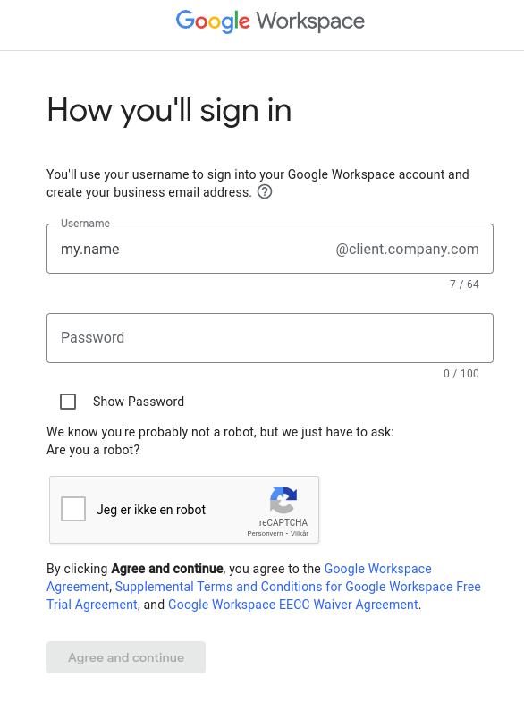

When creating a Google Workspace to get Gmail for an organization on their own domain, you have to add a first user. This process can be a bit cumbersome if you are creating an email solution for a client, and you do not personally need to be involved in the organization. But you want to be able to configure the workspace in case the client needs some updates, such as adding a forwarding address, adding an organization member, or making an email alias.

## Possible solutions

I will present 2 suboptimal solutions, and a third solution that involves a bit more tinkering, but is clearly superior in my opinion.

### Use the client’s account to administer

When setting up the workspace, you can create my.clients.name@company.com as the first account. This works fine when initially setting up the account, but if you want to do some changes later, you have to share the password with your client to use this account. Since your client will use this email in their work, it’s a bit weird if you should have access to their emails and documents. Especially if you’re just an outside “IT person” for the organization.

Additionally Google will sometimes require you do verify the account with a phone number. If you want to use your client’s phone number, you have to coordinate the approval SMS message flow, which can be cumbersome, time consuming and annoying for your client.
An alternative is just using your own phone number, but then you will link your phone number to the client’s account.

### Use your own account or an administrator account

This is a bit cleaner. You can make your.name@company.com or administrator@company.com as the first account, and use that later when you have to do changes. It’s still a bit inelegant if you are not really a part of the organization, and just the outside person setting up emails.

You or your client also has to pay the subscription for this account, which is wasted money if you are not using Gmail or Google Docs inside the organization, which is the normal case when doing IT work for clients.

The last solution allows you to use your own login without paying for a subscription.

### Use Google Cloud Identity in your Google Workspace

Google’s cloud platform offers something called Google Cloud Identity. It’s a complicated tool that can be used for everything from our simple case to managing complex access patterns in large organizations.

To use this with Google Workspace, you need to activate it on [https://console.cloud.google.com/cloud-setup/organization](https://console.cloud.google.com/cloud-setup/organization).

Select _I’m a current Workspace customer_, and enable Cloud Identity. Note that you have to verify your domain first, which is something you have to do to use Gmail with Google Workspace.

You activate Cloud Identity Free in your Google Workspace [https://admin.google.com/u/0/ac/billing/catalog](https://admin.google.com/u/3/ac/billing/catalog). Click _Get Started_ and go through the short process.

You should now come to the licenses page of your Google Workspace, which was not available before you activated Cloud Identity. Here you can decide who of the organization members should have a license for Google Workspace. A license means access to Gmail, Google Docs, and everything useful in Workspace.

To remove yourself as a licensee, and thus not having to pay for your own account, you need to **turn off automatic licensing**.

After doing that, you can go to your own user, scroll down to Licenses, and turn it off for Workspace (not for Cloud Identity!).

You now save some money, and do not use any of the quota of 10 users allowed for a standard workspace.

Remember that new users you add now, will not have a license automatically, so you have to assign it to them manually if they are to be able to use Gmail etc.

## Additional steps

Some additional steps can be taken if you want.

### Forward emails to your own account

If you still want to be able to see emails sent to your account in your client’s organization, you can solve this by setting up a forwarding rule in Google Workspace’s Gmail settings. This can be useful if you use e.g. administrator@company.com or your.name@company.com to sign up for software tools or something else online.

To do this, go to Apps > Google Workspace > Gmail, scroll down to _Routing_ and click. Configure _Email forwarding using recipient address map_ where you enter your email in the organization, and your preferred destination email.

After adding the rule, wait a few minutes before you send a test email, as this takes some time to update in Google’s systems. Also remember that you have to set up Gmail for this workspace by adding MX records etc. in your DNS settings for email forwarding to work.

### Log in to the organization with another email

Maybe you have a bazillion Google accounts, and want to just use a few of them in your daily work. I tried adding my personal email to the client’s organization in Cloud Identity, but that does not seem to be possible. Only emails ending with the organization’s domain name can be added as far as I know as of March 2023.
