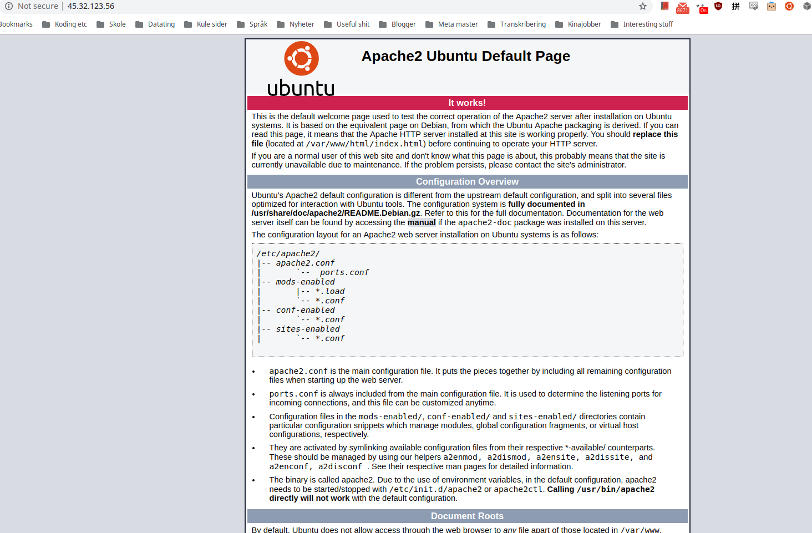

---
extensions:
  preset: ""
title: Complete guide to withdrawing Grin from Bitforex with HTTPS
date: "2019-06-24"
language: english
tags: "grin, crypto, exchange"
---

Operating a Grin wallet is more complicated than a Bitcoin wallet. Transactions require an interactive exchange between the sender and reciever. One way of doing this is to establish a HTTP connection between the transacting parties, and even though a transaction can be made in other ways, this is the only method supported by Bitforex.

In fact, Bitforex requires an HTTPS connection, which is not very easy to have on your PC, as you need a certificate and whatnot. This tutorial will explain how you can set up a Grin wallet that accepts transactions over HTTPS using cloud servers.

## Goals

Withdraw Grin from Bitforex (or other exchanges) to your personal Grin wallet.

## Prerequisites

Domain name – Any domain name you own is fine. If you don't have one, get one for your future blog, business, or homepage. I can recommend to buy it on [Namecheap](https://www.namecheap.com/)
Credit card – To pay for a virtual server
Grin wallet – I will use Wallet713
Grin – Can be bought on [Bitforex](https://www.bitforex.com/en/invitationRegister?inviterId=2117019) or a few other exchanges

## Heads up

We will use the command line and many computer related expressions, I hoped to make this tutorial easy for everyone, but I realized it will be hard if you're unfamiliar with the command line.
Some of the links I use are affiliate links, but all the links are to services I use myself and that are necessary to withdraw Grin over HTTPS.

## Setting up a server

Go to [Vultr](https://www.vultr.com/?ref=8097384), register and click on the plus button to set up a new server. Select a location close to you, choose Ubuntu version 18.10 x64 and the cheapest server size (\$5 in Singapore). Skip all other steps except the SSH key if you know what setting up an SSH key means, and click Deploy Now. You need to wait a couple of minutes for the virtual server to be prohobosedssss in Vultr's data center, so go grab a cup of milk tea or something.

## Configuring the server

### Access the command line

TODO use console

### Install Apache

You need to install a web server on your computer to handle incoming connections. We will use good old Apache for this tutorial as it's so commonly used.
First, we update the software on the server with `apt update` and `apt dist-upgrade -y`.
Then, we install Apache with `apt install apache2 -y`. (We automatically configure a firewall for the server with `ufw allow 'Apache Full'` – this opens only ports 80 (HTTP) and 443 (HTTPS).)
You should now be able to visit your virtual server in a web browser by typing in the IP address you see on Vultr in your address bar. If you don't get this page, something is wrong. You can debug by following a more detailed tutorial [here](https://www.digitalocean.com/community/tutorials/how-to-install-the-apache-web-server-on-ubuntu-18-04).

#### Configure your domain

Go to the DNS page for your domain on whatever site you bought the domain on. Since every domain site is slightly different from another, I can't give too detailed instructions here unless you use Namecheap. You can use a domain you already use for something else, just set up a record with grin as a subdomain.

We continue configuring the server by making a virtualhost (do we need this for GRIN???)

### Configure SSL certificate

The reason we do all this is to prove we have an SSL certificate. Having an SSL certificate is what allows us to use HTTPS. We need to install something called Let's Encrypt and configure Apache some more.
Run `add-apt-repository ppa:certbot/certbot -y` and `apt install python-certbot-apache -y` to install certbot.
We ask Let's Encrypt to give us a certificate with `certbot --apache -d grin.vikfand.com`. You can enter your email or a dummy email and accept some terms and conditions. Enter 1 when they ask about redirects, as we don't need to redirect anything.

## Install Grin wallet

Let's finally get to the Grin stuff and install a wallet. I use the [vault713](https://github.com/vault713/wallet713/blob/master/docs/setup.md) wallet, but you can also use the default Grin wallet.
Install the wallet with `curl https://wallet.713.mw/install.sh -sSf | sh`. Note that installing a wallet like this without verifying PGP signatures is not good practice, as there is a slight chance you can install a fake wallet made by hackers. Don't follow this tutorial if you handle large funds.
Anyway, start the wallet with `./bin/wallet713`. You should already have a wallet and a mnemonic, so enter 2 and type your mnemoic phrase. It will take about 1 minute for the wallet to recover the seed, so wait a little bit and verify that the grinbox address it outputs is the same as the one you have on your own computer. You can now exit.
We need to edit one file to make the wallet accept connections over the internet. Open it with `nano /.wallet713/main/wallet713.toml`. Just add the line `foreign_api = true` to the file and save it. When you start the wallet again with `./bin/wallet713 -p yourpassphrase`, it should show that it listens to foreign api at `127.0.0.1:3415`.
The last thing we need to do is set up a proxy in Apache that redirects connections to port 3415, where our Grin wallet is listening.

### Proxy in Apache

We need to add three lines to a file Let's Encrypt has generated for us. Open the file with `nano /etc/apache2/sites-enabled/grin.vikfand.com-le-ssl.conf`. Insert the following lines above the second last line in the file, so that it's above `</IfModule>` and `</VirtualHost>`:

```
SSLProxyEngine On
ProxyPass /abr http://127.0.0.1:3415
ProxyPassReverse /abr http://127.0.0.1:3415
```

Save the file and make sure the we made no mistakes with `apache2ctl configtest`. Oops! It does not work. That's because we need to configure Apache as a proxy server by enabling mod_proxy with `a2enmod proxy_http`. Run `apache2ctl configtest`, and restart apache with `systemctl restart apache2` to enable our changes.

## Withdraw Grin

Start the wallet again with `./bin/wallet713 -p yourpassphrase`. On your local computer make sure the wallet on your server is actually listening to requests with:

```bash
curl -X POST https://grin.vikfand.com:443/abr/v1/wallet/foreign/build_coinbase -d '{"fees": 0, "height": 13}' -H "Content-Type: application/json"
```

If you get a response with a long hexstring it means everything works. Congratulations. If something went wrong, you have my sympathy. This is not exactly easy. Take a walk and try again later.

Your grin HTTPS address is now `https://grin.vikfand.com/abr` – just switch vikfand.com with your domain, but keep the `/abr`, as that is the pattern we chose in our Apache proxy config.

Go to Bitforex, select assets in the top menu, select withdrawals in the left menu, select GRIN from the dropdown of coins. Choose add frequently used address and enter `https://grin.vikfand.com/abr` with your domain in both fields. Try withdrawing a small amount like 1 grin first. For me, Bitforex was a little bit buggy here. I got a strange error message saying "identifier is invalid" or something. Just refresh the page if you get it, and you should see the transaction being applied. You can type `info` into your grin wallet on the server or reload the Bitforex page to see the status of your withdrawal. I got mine in a couple of minutes.

You may notice that your grin wallet or your local computer won't notice the new funds yet. Just type `check` in wallet713 on your local computer to have it search the blockchain and find your grins.

If you have a lot of grins, you should generate a new wallet on your local computer and transfer the funds there. Since the wallet we made on the virtual server is in a data centre somewhere, we won't know if somebody watches it and steals your mnemonic phrase. It's also kinda risky for amateur users to expose our wallet to the open internet like we did, as just a small configuration mistake can be abused by an adversary. I saw in the Apache server logs that some unknown bot visitors were probing the server even though it was just minutes old.

## Afterthoughts

Grin is still in the early stage. Only those willing to get their hands dirty with the command line and configuring web servers will become first class Grin citizens with ownership of their keys. I hope exchanges start supporting less complicated withdrawals soon, so we don't need all this setting up a server stuff. On the other hand, I'm optimistic that the price will rise quickly once Grin becomes available to the masses, and maybe used in some Darknetmarkets. I think I'll try making my first purchase with Grin by buying some quirky stuff at [https://tmgox.com/](https://tmgox.com/).
