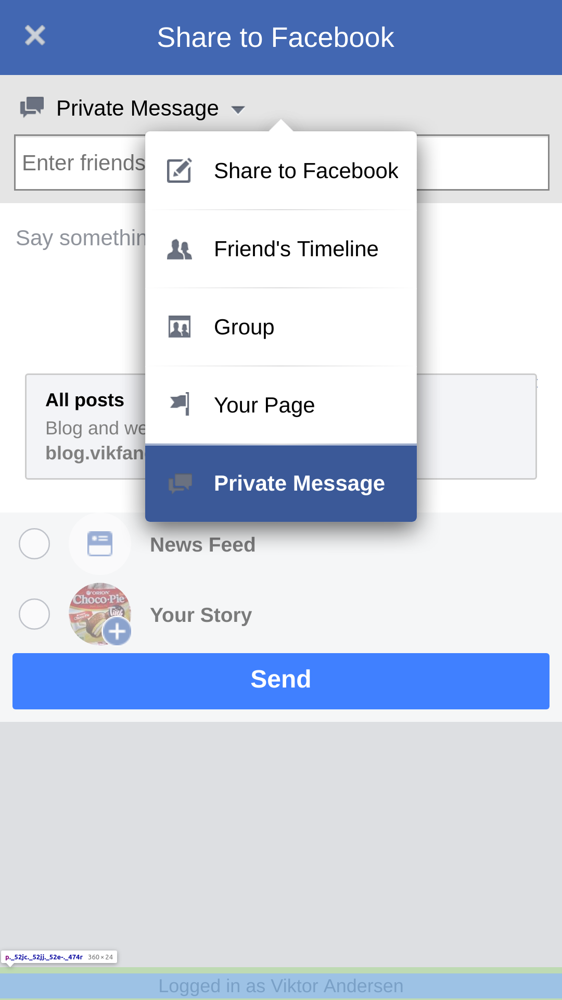
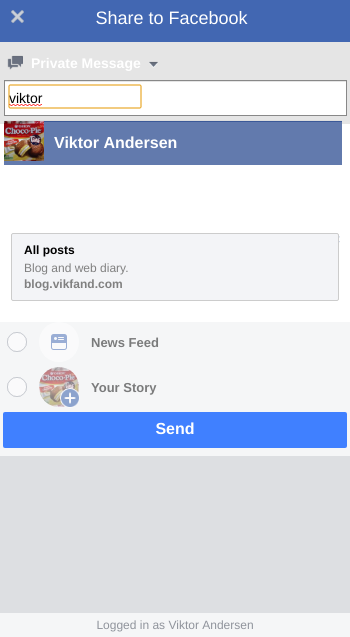
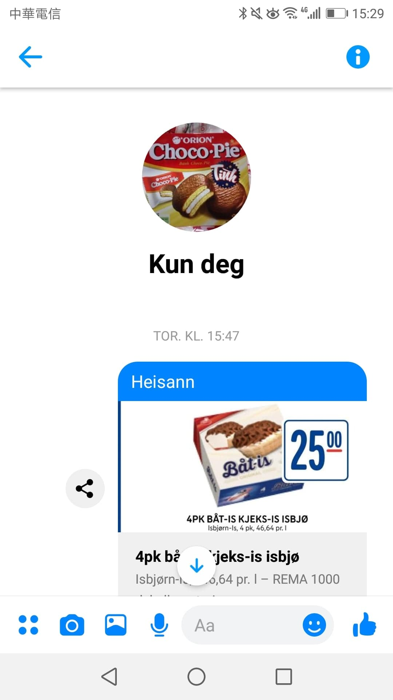

Did you know it's possible to have a conversation with yourself on Facebook Messenger? I discovered it by accident when creating a share button for my grocery price comparison site [https://allematpriser.no](https://allematpriser.no). It's convenient to have a convo with yourself as it makes it possible to easily share text and files between your devices.

1. Click <button>
   <a href="https://www.facebook.com/sharer.php?u=https%3A%2F%2Fblog.vikfand.com%2F" target="_blank" rel="noopener noreferrer">THIS BUTTON</a>
   </button> and wait until Facebook is loaded.
2. Select **Private Message** or similar if in another language.
   

     
   

3. Find yourself by searching.
   

     
   

4. Click **send** and wait.

You can now check Messenger on your computer or phone and use your private conversation however you want.

  

