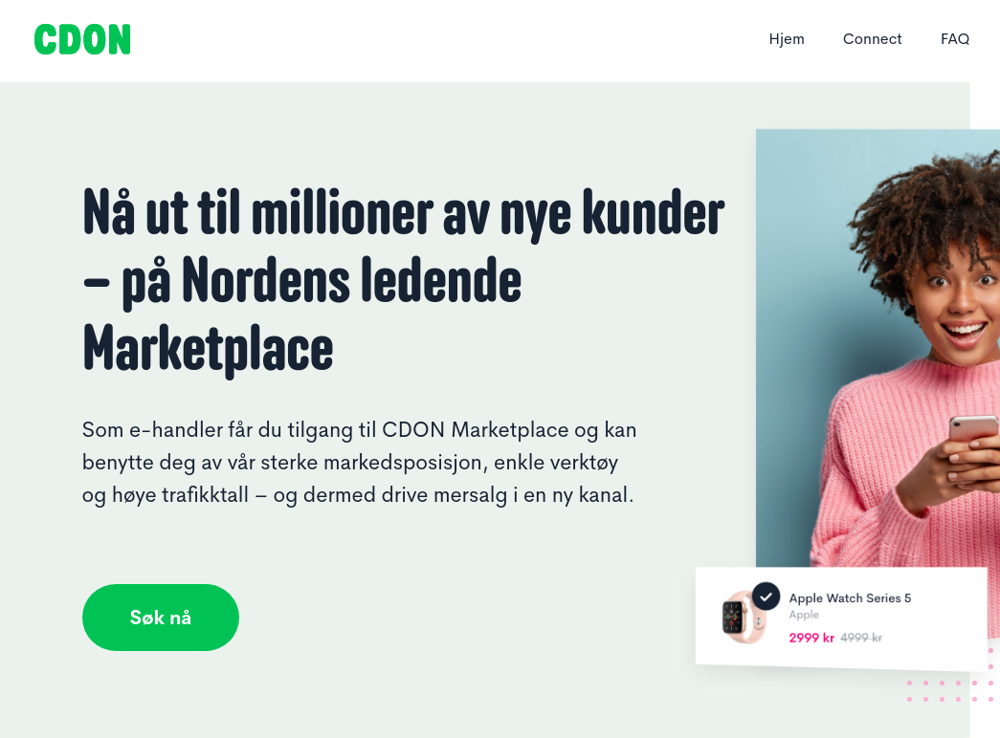
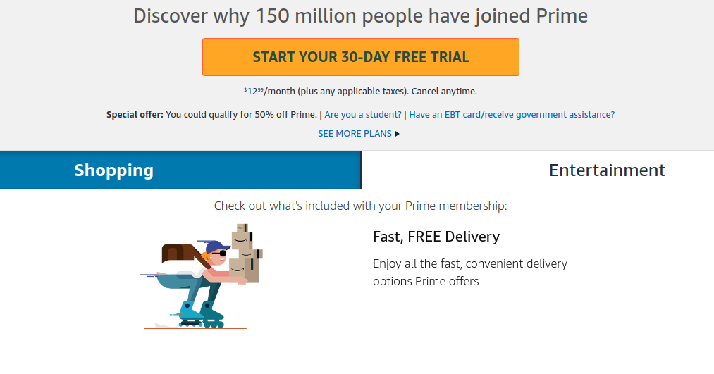

Vi lever nå i de siste månedene før giganten Amazon endelig kommer til Norden. Vårt verdenshjørne gjenstår som et av de siste markedene uten en eller flere *kjempeplattformer* for netthandel, og det er der Amazon ser muligheten.

En "kjempeplattform" er ikke bare et vagt buzzord. Jeg mener en *aggregator* i [Ben Thompson's definisjon](https://stratechery.com/aggregation-theory/). Kort sagt er det et fenomen som oppstår når nettverkseffekter fører til en positiv feedback-loop som stadig forsterker den dominerende spilleren i markedet. Jeg beverer ordet plattform fordi plattformsfunksjonaliteten er en viktig distinksjon mellom Amazon og alle nettbutikker vi har i Norge idag.

Amazon lar andre butikker selge sine varer på amazon.com. For andre butikker er det attraktivt fordi Amazon kan ta seg av betaling, frakt, lager, kundeservice og mer. Men aller viktigst er det at de fleste kundene er på Amazon allerede. Det at flere selgere velger Amazon fordi kunder er der gjør at Amazon's priser og utvalg blir enda bedre. Det fører igjen til at flere kunder velger Amazon. En positiv feedback-loop.

Av lignende grunner har f eks FINN.no blitt dominerende på boligannonser i Norge. Ingen boligselgere vil risikere å ikke ha en annonse på Finn. Det gjør at boligkjøpere kun sjekker annonsene på Finn, fordi de vet at alle annonsene er der. For en konkurrent å bryte den posisjonen Finn har der er utrolig vanskelig. 

## Alternativer i Norden

I Norge ville både Elkjøp, Komplett og Finn lage egne plattformer for netthandel med samme modell som Amazon. Det var en stusselig og lite gjennomtenkt satsning fra alle sammen, fordi de ga opp og la ned [kort tid etter](https://blog.vikfand.com/posts/kolonial-norges-amazon/).

[CDON.com](http://cdon.com) er så vidt jeg vet eneste Nordiske selskap med noe som potensielt kan måle seg med det Amazon vil komme med. CDON.com er ikke lenger bare din platebutikk på nettet. Andre butikker som maxgaming.com, computersalg.com, adlibris.no, og mange fler selger sine varer gjennom CDON.com sin løsning. Dette er nesten usynlig for brukeren, men det fører til at CDON har det desidert beste utvalget av varer på nett i Norden med flere millioner artikler.

Hvis den tidligere plategiganten kan fortsette å pushe på som plattform ved å få enda flere partnere, enda bedre betalingsløsninger, og enda bedre kundeservice, kan de muligens bygge en såpass sterk barriere at de kan bli en likeverdig konkurrent for Amazon.

Men antakeligvis vil de ikke klare å slå Amazon på det å være en plattform for netthandel. Ikke minst fordi de har hatt flere år på seg til å komme med markedsføring og kundeklubber som Amazon Prime til å faktisk sementere posisjonen sin, men ikke gjort det i betydelig grad.

## Hva vil Amazon.no se ut som?

Det blir spennende å se hvordan Amazon lanseres i Norden. De vil med sin svært effektive drift og lange erfaring antakeligvis kunne gi de beste prisene på nesten alle merkevarer. Jeg regner med at de vil lansere med flere store partnere på laget slik at de også selger varer i flere nisjer. Bare det vil gjøre Amazon til det mest naturlige stedet for en kunde å gå til for å handle noe på nettet.

Det mer usikre er om de vil lansere tjenester som Prime. Med medlemskap i Prime betaler man en liten sum i måneden mot at man får man gratis frakt på alt man bestiller. I USA får man også raskere leveringstid. Med en slik tjeneste og enormt utvalg vil kunder ha liten grunn til å engang sjekke andre butikker når de skal kjøpe noe.

Amazon har i andre markeder brukt både egne løsninger og eksisterende tjenester for frakt av varene. F eks i USA begynte de å kun bruke posten til å levere for å så bygge et eget nettverk med egne biler og til og med fraktfly for å kunne levere raskere og billigere enn konkurrenter kunne drømme om. På dette området har CDON.com ingenting å konkurrere med. I Norge kan muligens Kolonial.no kunne måle seg med tilsvarende raskt frakttilbud. Kolonial har begynt å lage et nettbutikk i [motsatt ende som Amazon](https://blog.vikfand.com/posts/kolonial-norges-amazon/). De har nå en knallgod logistikktjeneste i Oslo og Omegn, men om de kan begynne å selge varer med høyere margin enn dagligvarer gjenstår å se.
