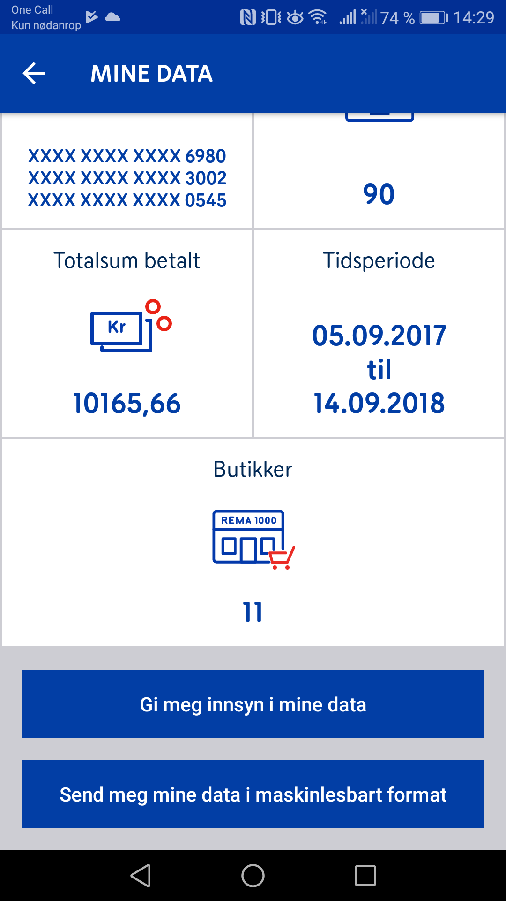
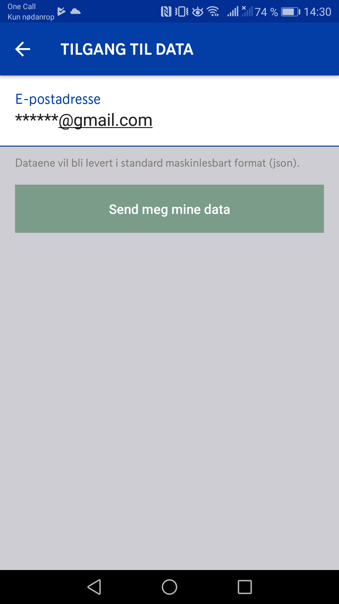

EU sitt direktiv om personvern på nett har nå trådt i kraft og er blitt en del av norsk lov under [personopplysningsloven](https://lovdata.no/dokument/NL/lov/2018-06-15-38). Som del av dette skal alle som har data lagret om seg ha rett til innsyn i deres data, og kanskje viktigere, ha _“[...] rett til å motta personopplysninger [...]  i et strukturert, alminnelig anvendt og maskinlesbart format [...]”_. Videre hintes det til at slik data skal kunne overføres automatisk fra en tilbyder til en annen _“[...] ha rett til å få overført personopplysningene direkte fra en behandlingsansvarlig til en annen.”_ [[Artikkel 20](https://lovdata.no/NL/lov/2018-06-15-38/gdpr/a20)] Dette med data i maskinlesbart format betyr at en app skal kunne lese og bruke dataene, slik at man skal kunne bytte tilbyder, eller la en annen tilbyder bruke din data, på en enkel måte. Et fint ord som brukes til å beskrive dette er dataportabilitet. For eksempel skal det da være mulig å automatisk sende hele Facebook-profilen din til Google+, eller overføre alle preferansene dine fra hotels.com til booking.com.

Vi skal bruke Rema 1000 sin Æ app som eksempel på hvordan denne loven kan gi deg som kunde mulighet til å analysere egne data på en måte som ikke var mulig før.

_Rema følger så vidt jeg kan se GDPR til punkt og prikke, og har attpåtil veldig bra brukergrensesnitt. Mange andre selskaper prøver å hindre deres brukere i å få tilgang til data til tross for loven._ \*

Butikkene lagrer og bruker data om kundene sine til å optimalisere sitt sortiment og sine priser. De kan f eks analysere når på dagen visse grupper handler visse varer. For å få til dette må de lagre data om produktene kunder kjøper, som er omtrent alt som står på papirkvitteringen man får i kassa. Derfor kan man få utlevert strukturert og utfyllende data om alle varer man har kjøpt fra Rema. Dette kan man importere til et regneark som excel og analysere selv, eller bruke en tjeneste eller app som gjør dette for deg. Jeg er både interessert i privatøkonomi og dagligvarehandelen, så dette er som en gullgruve av interessant data for meg. Det vil f eks være potensiale til å sammenligne priser og varer mellom alle dagligvarehandler, finne ut hva man bruker unødvendig mye på, automatisk trekke fra noen varer dersom man handler med en felles famlie- eller bofelleskapskonto, osv. Med et lengre tidsperspektiv vil man også i fremtiden kunne analysere dagligvarehandelen sin gjennom flere tiår.

Digitale kvitteringer er utrolig kjekt, men ikke noe nytt. Tidligere har butikker hatt retten til å bestemme om de vil gi deg en digital kvittering eller ikke. Nå må i praksis alle butikker som har et kundefordelsprogram utlevere en til sine kunder.

\* Dette gjøres bl.a. ved å lage dårlig brukergrensesnitt, ikke tilby maskinlesbar data, eller bruke sin rett til å ikke gi opplysningene før om 30 dager. Det skal også sies at mange selskaper sliter med å følge GDPR pga. manglende IT-ressurser og reelle tekniske utfordringer.
