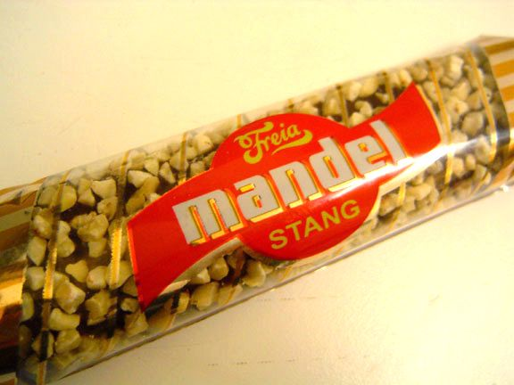
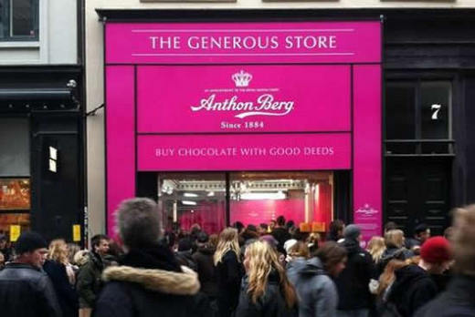
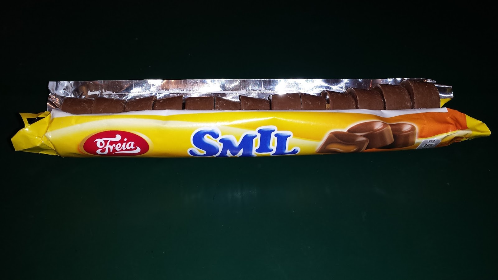

Å finne et navn er en stor ting for et nytt selskap, et nytt produkt, en ny blogg, et nytt barn, eller hva enn du har. Det er nok noe nybegynnere bruker unødvendig mye tid på. Jeg har til og med hørt om folk som vil starte en business kun fordi de eier et domenenavn. Jeg tror vanglivis det viktigste er å ha et navn som er lett å si og lett å skrive. La oss se på noen taktikker rundt det å velge navn med utangspunkt i norske sjokolader.

### 1 – Bokstavelig talt

Noen kaller bedriften eller produktet akkurat hva det er, og ferdig med det. Eksempler fra sjokoladeverdenenen er da Mandelstang, Banankrem, Kex og Helnøtt. Det er jo rimelig enkelt, og kunden skjønner umiddelbart hva produktet ditt dreier seg om. Det er kanskje den beste taktikken når man ikke har tid eller evne til å bygge et merkenavn i seg selv. Bare ikke gjør som Gullbrød og lov mer enn du kan levere. 

_En stang med mandler._

### 2 – Bygge merkenavn fra bunn av

På den andre siden av spekteret har vi de som finner på et helt nytt ord, og med reklame eller dekning i pressen, etter tid klarer å gjøre det til et nytt merkenavn som står på egne ben. Få sjokolader klarer dette, men jeg tror Snickers og Kit Kat ikke hadde noen betydning før sjokoladen. Å bruke sitt eget navn som produktnavn er en litt mindre kreativt, men litt mer ambisiøst enn å finne på et nytt ord. Anthon Berg jobbet hele livet og satt ryktet sitt på spill ved å lage konfekt og ble ganske kjent for det.

_Å bygge merkenavn fra bunn av er mye jobb, men kan lønne seg veldig._

### 3 – Ta et positivt ord

Hvis man ikke vil være bokstavelig eller bygge et merkenavn fra bånn av, kan man bare ta et ord som allerede vekker positive assosiasjoner. Smil har åpenbart gjort nytte av dette trikset, og mange andre er i grenseland. Vi har New Energy, men sliter med å finne flere som bruker dette enkle trikset. Nero våger å gjøre det stikk motsatte, og tar navnet til den romerske keiseren Nero som er beryktet for å være ond, sadistisk, og dårlig på jobben sin som keiser.

_Kjøp meg og smil :):):):)_

### 4 – Ta et ord din målgruppe allerede liker

Denne er litt vrien. Jeg tenker på Kong Haakon, Lohengrin, Sport Lunch – kanskje Cuba og Bounty. Lohengrin ble laget spesielt i forbindelse med visningen av Wagners opera med samme navn på Nationaltheatret i 1911, og ble designet av arkitekten Henrik Bull. 108 år senere besluttet Freia å ikke produsere sjokoladen lenger pga lite etterspørsel. Skulle de byttet navn til _The Sound of Music_ eller noe? Denne taktikken er på en måte en målrettet bruk av å ta et generelt positivt ord.

_Lohengrin ble spist for første gang i 1911. Salget stoppet i februar 2019 pga lite etterspørsel._

### 5 – Ta et ord løst tilknyttet ideen din

Stratos høres litt luftig ut, eller hva? Bounty er en tropisk øy i stillehavet og bruker den tropiske ingrediensen kokos. Troika er en trio og består av 3 elementer. Twix har to "pinner", og twigs betyr pinne på engelsk, og twix betyr sikkert tvillinger på latin eller noe. Føler at de som velger navn på denne måten vil være litt kreative, men ikke for kreative.

_Troika tok steget fra å være en bokstavelig-talt-sjokolade kalt gele-trøffel, til dagens navn som lover trippel nytelse._

### 6 – Bare ta et ord...

Noen navn ser ut til å bare komme fra løse lufta. Monolitt, Firkløver, Hval, Lion ... Hobby! Det er ikke nye ord, men de har ingenting med sjokolade å gjøre. Man må bygge det nye ordet som et merkenavn, og det er et ord folk er kjent med, og som er lett å si.

_Hobby. For deg som har en hobby._

Mangler jeg noe? Kan noen lage en tilsvarende for bloggere? Komikerfrue og Trines Matblogg er bokstavelig-talt-navn. Sofie Elise bygger et brand rundt sitt ekte navn. Voe er et helt nytt ord?

PS:  
Kom over en gammel reklame for Troika da jeg gjorde "research" for denne artikkelen. Husker den ofte gikk i reklamepausen mellom Mot i Brøstet og Hotel Cæsar..
`youtube:https://www.youtube.com/embed/AuXk7nNFhlE`
