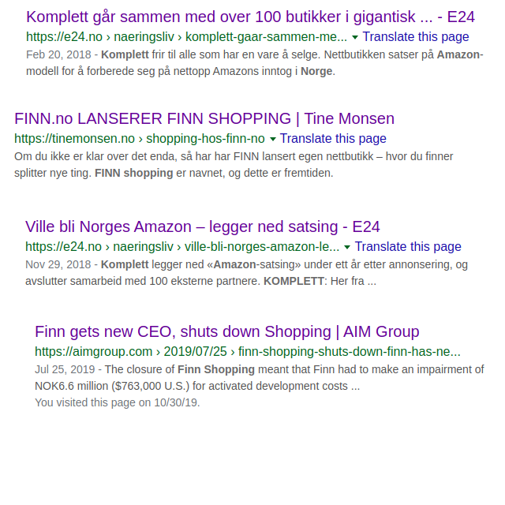
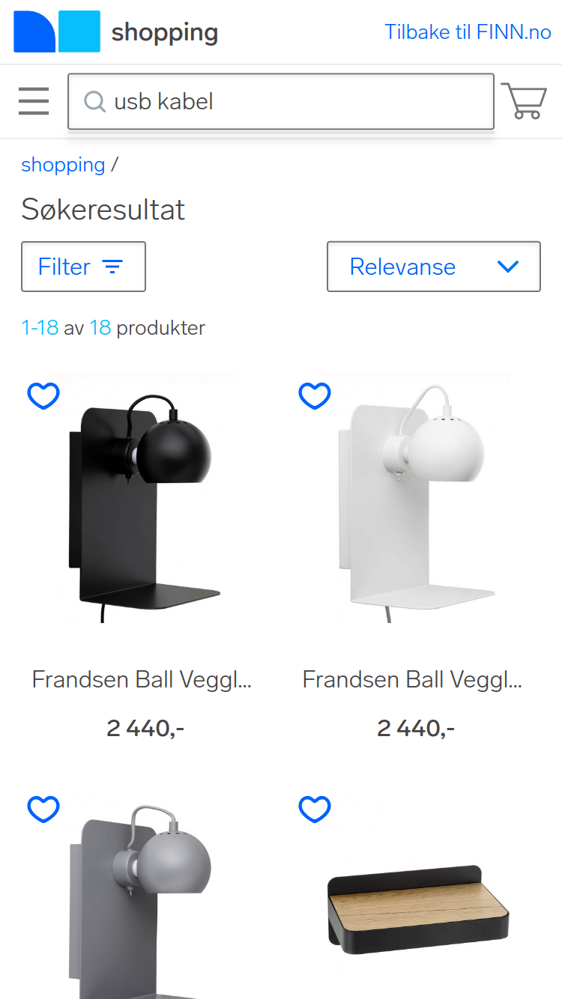

2018 begynte med noen spennende nyheter for ehandel i Norge. Både Finn og Komplett kunngjorde at de skulle lansere tjenester for å bli "Norges Amazon", ved å tillate andre nettbutikker å selge varer gjennom deres plattform. Dette er en modell som kan være innmari lønnsom – noe Amazon, Alibaba, Lazada, Shopee, Etsy, og andre vitner til. Men det er tydeligvis ikke så lett å få til, hvertfall ikke i et marked som Norge, for både Komplett og Finn ga opp sine ambisiøse satsinger veldig fort.

Det kan være synd for den norske forbrukeren, da vi nå er et av de få landene i verden uten en skikkelig online shoppingplattform. Det har vært snakk om at Amazon vil komme til Norge, kanskje med en felles skandinavisk ordning, men det er så vidt jeg vet ingenting som tyder på at det vil skje snart.

For de som ønsker å selge på nettet i Norge betyr det at den eneste løsningen fortsatt er å starte egen nettbutikk og markedsføre den selv, eller evt. bruke torget på Finn.no til å trekke til seg kunder. Det er klart at en slik situasjon vil føre til verre utvalg, høyere priser, og færre nye bedrifter, da det er mer friksjon i å starte egen nettbutikk å markedsføre denne enn ved å kun lage annonser på Amazon e.l. slik mange som driver med netthandel i andre land gjør. Finn gir så vidt jeg vet ingen mulighet for automasjon eller integrasjon med andre plattformer, så det er ikke på langt nær like knirkefritt som f. eks. [Amazon FBA](https://services.amazon.com/fulfillment-by-amazon/benefits.html) er.

[Kolonial.no](http://kolonial.no) er den nye internettkjempen for forbrukermarkedet i Norge. De driver for tiden med dagligvarer og går i kraftig underskudd, og det er kanskje å forvente når de velger å gå inn i en beryktet bransje dominert av et par-tre giganter. Matvarer er kanskje den typen varer som er minst passende for netthandel, men Kolonial har klart å bygge et flott distribusjonsnettverk som stort sett består av egne og innleide sjåfører med varebiler som kjører varer til hjem og bedrifter på Østlandet.

De har egentlig klart å lage et budselskap som også har en nettside for dagligvarer. Bud og transport er en hårete bransje, men de har bygd et imponerende distribusjonsnettverk, som muligens kan være lønnsomt i fremtiden hvis de kan gi bedre priser og service enn konkurrenter som Posten og Postnord.

En spennende utvikling som begynte i 2019 er deres samarbeid med Clas Ohlson som gjør det mulig å bruke Kolonials budbilsnettverk til å også bestille varer fra gubbebarnehagens utvalg. Kolonial integrerer sitt distribusjonsnettverk med Clas Ohlsons vareutvalg ved å ha noen produkter på lager og på nettsiden sin. Så enkelt kan kunder bestille en rekke nye varer og få dem levert hjem på døren på et par dager – ikke ulikt slik det er i USA med Amazon Prime eller i Kina med Taobao og JD. Om dette er starten på Norges egen Amazon gjenstår å se. Det kan tenkes at de også vil åpne for alle andre å selge sine varer gjennom Kolonial, men jeg er egentlig skeptisk, da Kolonials forretningsmodell foreløpig ikke er bærekraftig, og at utfordringen i å starte en plattform som Amazon er større enn selv Kolonial kan håndtere.

Amazon begynte som kjent med å selge bøker, da dette var en ideell vare for netthandel. De har vokst til å bli et av verdens største selskaper mens de stort sett har brukt den nasjonale posttjenesten eller andre transportselskaper til å faktisk sende varene deres. Først nå i det siste har de begynt med eget transportnettverk. Også kun i det siste har de begynt å selge matvarer i USA, og det er slett ikke sikkert om det vil lykkes med det. De har også hele tiden vært kjente for å ha god kundeservice og ikke minst være åpne for at andre kan integrere seg med deres plattform både som selger eller affiliate.

Kolonial ser ut til å starte i andre enden ved å begynne rett på matvarer og eget transportnettverk. Det ser ut til å gi lite mening, for det er ikke særlig skalerbart, og som følge taper de penger til tross for høy omsetning og mange kunder. Kanskje er det mulighet for at de kan bruke kundemassen og transportnettverket til å selge mer lønnsomme varer. Kanskje de kan få mer investorpenger til å renne inn hvis de prøver å bli en plattform og tar opp utfordringen Finn og Komplett mislyktes med.

