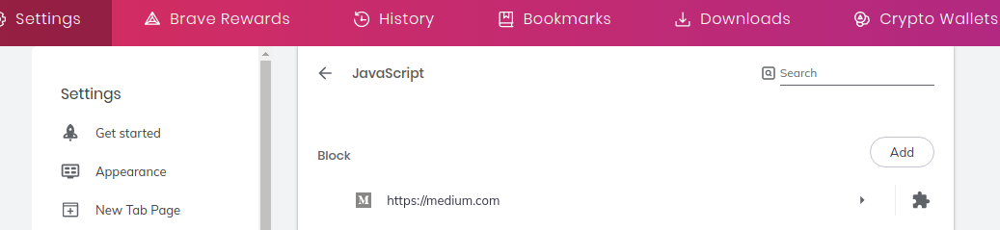

Lots of people write articles on Medium.com. Some of these articles are very useful and also rank very high on the Google search results. I often search for a solution to a software development problem I have, and am so happy to see somebody has made a Medium post about it.

Then I enter the page ...

It used to be just an annoying popup blocking the screen. But I could dismiss that. And we kinda take thay level of annoyance as a minimum in this post-GDPR phase of the Internet.

Then Medium started hiding the text in the article. You had to create an account and have a subscription to read it. Those poor article authors who thought posting to Medium rather than their personal blog would give them more exposure.

Now, Medium won't even load on my computer. I don't know whether it's the battle between my adblockers and Medium's tracking scripts leaving the entire site as a unusable ruin. Or maybe I have too many weird extensions that are incompatible with Medium. Anyway, I figured I had to make Medium readable again with another extension.

## Fix it by blocking Javascript with an extension

The simples solution in my opinion is just installing the [Quick Javascript Switcher](https://chrome.google.com/webstore/detail/quick-javascript-switcher/geddoclleiomckbhadiaipdggiiccfje) extension, and add medium.com to the list of blocked sites. After installing the extension, [this is the link to the settings](chrome://settings/content/javascript).

## Enjoy reading Medium articles again

All the popups, banners, login prompts etc will be gone when simply blocking Javascript.
