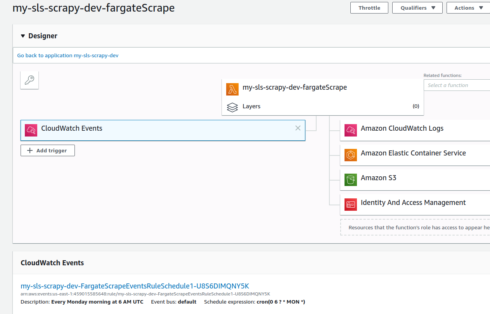

## Running Scrapy in AWS Lambda

We will be using the [Serverless framework](https://serverless.com/) in this tutorial, as it's a good and extendable open-source framework that does much of the gruntwork of serverless applications. [Scrapy](https://scrapy.org/) is a Python framework, also leading and open-source, with all the benefits that come from using a mature framework. Since only [Amazon Web Services](https://aws.amazon.com/) (AWS) of the major cloud platforms support Python in serverless functions, it's a natural choice that can't go wrong since AWS has solutions for just about everything.

The code used in this guide can be found on [github.com/viktorfa/scrapy-fargate-sls-guide](https://github.com/viktorfa/scrapy-fargate-sls-guide).

### Requirements

It's assumed that the reader is somewhat familiar with Scrapy and has the ability to work with the command line. Several programs need to be installed to complete this guide. An AWS account with billing enabled is necessary (although the resulting bill from completing the guide is in order of single digit cents).

Command line tools used:

- virtualenv\*
- git\*
- npm
- pip
- make
- docker
- aws

\* recommended, but not necessary

### Result

Completing this guide will result with the basics of a scalable and maintainable scraper infrastructure following the _serverless_ paradigm with all its advantages such as low initial cost and infrastructure as code deployment. The resulting artifact will be extended in a similar fashion with a data processing pipeline in future guides.

## Setting up a crawler

We start by making a simple Scrapy crawler that can run from a script locally, and move thinfs gradually from there.

### Creating the scraper

```bash
python -v # Should have python3.7
pip install Scrapy
```

```bash
mkdir scrapy-serverless && cd $_
scrapy startproject my_sls_scraper scraper
cd scraper
```

All the code of this guide will be in the `scrapy-serverless/scraper` folder, but other modules will be added in the `scrapy-serverless` folder in future guides.

We will use the default Scrapy project structure. Create a simple spider in the `spiders` module.

```python
# my_sls_scraper/spiders/header_spider.py
from scrapy.spiders import CrawlSpider, Rule
from scrapy.linkextractors import LinkExtractor


class HeaderSpider(CrawlSpider):
    name = "header_spider"

    start_urls = ["https://scrapy.org"]
    allowed_domains = ["scrapy.org"]
    rules = [  # Get all links on start url
        Rule(
            link_extractor=LinkExtractor(
                deny=r"\?",
            ),
            follow=False,
            callback="parse_page",
        )
    ]

    def parse_start_url(self, response):
        return self.parse_page(response)

    def parse_page(self, response):
        header = response.css("h1, h2").extract_first(
        ) or response.css("title").extract_first() or response.url
        return {
            "header": remove_tags(header),
            "url": response.url,
        }
```

Also add the following to the settings in `my_sls_scraper/settings.py`

```python
# my_sls_scraper/settings.py
# ...
HTTPCACHE_ENABLED = True
HTTPCACHE_EXPIRATION_SECS = 60 * 60 * 24 * 7
HTTPCACHE_DIR = 'httpcache'
CLOSESPIDER_PAGECOUNT = 32
```

Test that the spider is working by running the crawler and printing the output

```bash
scrapy crawl header_spider --output "feed/%(name)s-%(time)s.json" --output-format json
cat feed/$(ls feed -q | tail -1)
```

You should see a json feed in `feed/header_spider-<time string>.json` with the scraped data.

Next, we create files to launch the scraper from a script, which will be needed in Lambda and Fargate. We'll create 2 new files to make this work in different scenarios, `launcher.py` and `my_sls_scraper/crawl.py`.

```python
# my_sls_scraper/crawl.py
import sys
import imp
import os
import logging
from urllib.parse import urlparse

from scrapy.spiderloader import SpiderLoader
from scrapy.crawler import CrawlerProcess
from scrapy.utils.project import get_project_settings

# Need to "mock" sqlite for the process to not crash in AWS Lambda / Amazon Linux
sys.modules["sqlite"] = imp.new_module("sqlite")
sys.modules["sqlite3.dbapi2"] = imp.new_module("sqlite.dbapi2")


def is_in_aws():
    return os.getenv('AWS_EXECUTION_ENV') is not None


def crawl(settings={}, spider_name="header_spider", spider_kwargs={}):
    project_settings = get_project_settings()
    spider_loader = SpiderLoader(project_settings)

    spider_cls = spider_loader.load(spider_name)

    feed_uri = ""
    feed_format = "json"

	try:
        spider_key = urlparse(spider_kwargs.get("start_urls")[0]).hostname if spider_kwargs.get(
            "start_urls") else urlparse(spider_cls.start_urls[0]).hostname
    except Exception:
        logging.exception("Spider or kwargs need start_urls.")

    if is_in_aws():
		# Lambda can only write to the /tmp folder.
        settings['HTTPCACHE_DIR'] =  "/tmp"
    else:
        feed_uri = "file://{}/%(name)s-{}-%(time)s.json".format(
            os.path.join(os.getcwd(), "feed"),
            spider_key,
        )

    settings['FEED_URI'] = feed_uri
    settings['FEED_FORMAT'] = feed_format

    process = CrawlerProcess({**project_settings, **settings})

    process.crawl(spider_cls, **spider_kwargs)
    process.start()
```

```python
# launcher.py'
import sys
import json

from my_sls_scraper.crawl import crawl


def scrape(event={}, context={}):
    crawl(**event)


if __name__ == "__main__":
    try:
        event = json.loads(sys.argv[1])
    except IndexError:
        event = {}
    scrape(event)
```

Check that you can scrape by executing `launcher.py` with

```bash
python launcher.py
```

If that works, the scraper is pretty much done, and we'll spend the rest of the guide on AWS and Serverless stuff.

## Setting up an AWS Lambda function

Initialize serverless in the same directory as `scrapy.cfg` with

```bash
serverless create --template aws-python3 --name my-sls-scraper
```

You need to have an AWS account and created an IAM admin user to work with Serverless. If you haven't follow the steps on [this guide](https://serverless.com/framework/docs/providers/aws/guide/credentials/) to get started. I like using aws profiles where you store the credentials in `~/.aws/credentials`, but see the link for what works best for you.

If you're not familiar with AWS and Serverless, you will run into many weird issues that are hard to debug. To mitigate that, deploy the function for every change you make in the configuration of Serverless and the scraper to make it easier to identify what causes things to break.

We'll start by deploying the dummy default Lambda function. Do it with

```bash
sls deploy -f hello
```

If you use aws profiles for credentials and you have a profile called `my-sls-admin`, you can deploy with

```bash
sls deploy -f hello --aws-profile my-sls-admin
```

or add the profile key under provider in `serverless.yml`.

```yaml
# serverless.yml
# ...
provider:
  name: aws
runtime: python3.7
profile: my-sls-admin
# ...
```

When deploying, the output should be similar to

```
11:40 $ sls deploy
Serverless: Packaging service...
Serverless: Excluding development dependencies...
Serverless: Creating Stack...
Serverless: Checking Stack create progress...
.....
Serverless: Stack create finished...
Serverless: Uploading CloudFormation file to S3...
Serverless: Uploading artifacts...
Serverless: Uploading service my-sls-scraper.zip file to S3 (162.74 KB)...
Serverless: Validating template...
Serverless: Updating Stack...
Serverless: Checking Stack update progress...
...............
Serverless: Stack update finished...
Service Information
service: my-sls-scraper
stage: dev
region: us-east-1
stack: my-sls-scraper-dev
resources: 5
api keys:
  None
endpoints:
  None
functions:
  hello: my-sls-scraper-dev-hello
layers:
  None
Serverless: Run the "serverless" command to setup monitoring, troubleshooting and testing.
```

You should now see the deployed function in the [AWS Lambda web console](https://console.aws.amazon.com/lambda/home). (Change your region if you don't see it!)

Verify that the function can be invoked and see its output with

```bash
sls invoke -f hello --log
```

The output should be something like

```
12:12 $ sls invoke -f hello --log
{
    "statusCode": 200,
    "body": "{\"message\": \"Go Serverless v1.0! Your function executed successfully!\", \"input\": {}}"
}
--------------------------------------------------------------------
START RequestId: f38a0d84-e974-4a00-93ab-9e2825d94003 Version: $LATEST
END RequestId: f38a0d84-e974-4a00-93ab-9e2825d94003
REPORT RequestId: f38a0d84-e974-4a00-93ab-9e2825d94003	Duration: 1.62 ms	Billed Duration: 100 ms	Memory Size: 1024 MB	Max Memory Used: 56 MB	Init Duration: 110.34 ms

XRAY TraceId: 1-5d723275-c57192d30e2a524902b401fd	SegmentId: 5cc7e2685a1e85bc	Sampled: false
```

Now we'll need to package the function in a way that includes all the dependencies. Install the `serverless-python-requirements` plugin with

```bash
sls plugin install --name serverless-python-requirements
```

And rehaul `serverless.yml`.

```yaml
# serverless.yml
service: my-sls-scraper

provider:
  name: aws
  runtime: python3.7
  logRetentionInDays: 1

functions:
  hello:
    handler: handler.hello
  lambdaScrape:
    handler: launcher.scrape

# We include files by whitelisting to reduce the deployment time.
# Just remember to add any files you create!
package:
  include:
    - handler.py
    - launcher.py
    - my_sls_scraper/**
    - scrapy.cfg
  exclude:
    - "./**"

plugins:
  - serverless-python-requirements

custom:
  pythonRequirements:
    slim: true # Omits tests, __pycache__, *.pyc etc from dependencies
    fileName: requirements.txt
```

Note that we added a new function `lambdaScrape` that does the scraping in the Lambda function.

We also need a minimal `requirements.txt` for pip requirements.

```bash
# requirements.txt
Scrapy==1.7.3
```

Try to deploy the function again and see that it works.

```bash
sls deploy --verbose
sls invoke -f hello --log
sls invoke -f lambdaScrape --log
```

We've now created the minimal solution for serverless scraping – well done! In the rest of the guide we'll set up more resources in the AWS platform to store the scraped data and run long crawls in Fargate instead of Lambda.

## Storing scraped data in S3

Storing the scraped data in S3 gives us a low-cost repository for spider outputs which can be used to further process the data. We will use the config in `serverless.yml` and CloudFormation templates to create and use resources in the AWS ecosystem, so that we follow the _infrastructure as code_ paradigm.

Before we continue, let's install a useful plugin that lets us use `!Sub` commands in out templates called `serverless-cloudformation-sub-variables` and add it to our `serverless.yml` with

```bash
sls plugin install --name serverless-cloudformation-sub-variables
```

Let's create the templates in a separate file called `s3-template.yml` as the template will get quite large later.

```yaml
# s3-template.yml
Resources:
  ScraperFeedBucket:
    Type: AWS::S3::Bucket
    Properties:
      VersioningConfiguration:
        Status: "Enabled"
```

We have to set up permissions in `serverless.yml`, import the template file, and pass the bucket name in an environment variable to our Lambda function.
Add the following IAM role statement and environment variable

```yaml
# serverless.yml
provider:
	# ...
	environment:
	    FEED_BUCKET_NAME: !Ref ScraperFeedBucket
	iamRoleStatements:
	    - Effect: "Allow"
	      Action:
	        - "s3:PutObject"
	      Resource: !Sub
	        - "arn:aws:s3:::#{BucketName}/*"
	        - BucketName: !Ref ScraperFeedBucket

resources:
  - AWSTemplateFormatVersion: "2010-09-09"
    Transform: "AWS::Serverless-2016-10-31"
  - ${file(./s3-template.yml)}
# ...
```

You can check that your configuration doesn't contain syntax errors with

```bash
sls package
```

but the only way to check that your CloudFormation templates are valid on your current stack is to deploy it.
Before deploying, let's configure the crawler to store the output in S3.

```python
# my_sls_scraper/crawl.py
def  crawl(settings={}, spider_name="header_spider", spider_kwargs={}):
	# ...
	if is_in_aws():
        # Lambda can only write to the /tmp folder.
        settings['HTTPCACHE_DIR'] = "/tmp"
        feed_uri = f"s3://{os.getenv('FEED_BUCKET_NAME')}/%(name)s-{spider_key}.json"
	# ...
```

Scrapy uses the AWS library `boto3` under the hood to store to S3. Inside a Lambda function, boto3 is always available, and credentials are automatically discovered. It will work as long as the IAM Role Statements we configured for the Lambda function are correct.
We don't need to timestamp the file name in S3 with `%(time)s`, as we configured the bucket to use versioning in our CloudFormation template, which enables us to access old spider outputs by looking at the file history.

Now, deploy the function and crawl again.

```bash
sls deploy -v
sls invoke -f lambdaScrape --log
```

You should now find the feed output in a file if you check your [S3 console](https://s3.console.aws.amazon.com/s3/home). You should also see some new info has appeared for your function in the [Lambda console](https://console.aws.amazon.com/lambda/home), like the environment variable and the S3 resource.
While it's absolutely recommended to set up all resources in CloudFormation templates or other infrastructure as code frameworks, the AWS console web interface is very useful for debugging and inspection.

## Running Scrapy in AWS Fargate

We now have a crawler that can be run from a script and uses S3 to store its output. We can run it in AWS Lambda, but we are constrained by the 15 minute execution limit.
Lambda is simply not made for long-lasting tasks, but it is possible to run long-lasting crawlers in the serverless paradigm by _containerizing_ our crawler and running it as a task in a managed container service such as AWS Fargate. This means we need to create a [Docker](https://www.docker.com/) image of our crawler, uploading the image to an image repository – we'll use Amazon Container Registry (ACR), and execute the image in a container as a task in Amazon Container Services (ECS).
I'm dropping a lot of acronyms, and you'll see even more later. Running containers on AWS may be serverless, but it requires a lot of configuration at the moment.

### Dockerize it

If you have Docker installed, this is the easy part. Let's create a `Dockerfile` to containerize our crawler.

```docker
FROM python:3.7

WORKDIR /usr/src/app

COPY scrapy.cfg ./
COPY launcher.py ./
COPY my_sls_scraper ./my_sls_scraper
COPY requirements.txt ./

RUN pip install boto3 --quiet
RUN pip install -r requirements.txt --quiet

CMD ["python3", "./launcher.py"]
```

The docker file is the recipe to put our scraper in an image. Create it and put a tag on it with

```bash
docker build -t my_sls_scraper:latest .
```

You should see an output similar to

```
16:55 $ docker build -t my_sls_scraper:latest .
Sending build context to Docker daemon  15.62MB
Step 1/9 : FROM python:3.7
 ---> 60e318e4984a
Step 2/9 : WORKDIR /usr/src/app
 ---> Using cache
 ---> 0277144c85a9
Step 3/9 : COPY scrapy.cfg ./
 ---> c72f2df3b4d7
Removing intermediate container 80cf0e765353
Step 4/9 : COPY launcher.py ./
 ---> 58e18d409bf5
Removing intermediate container f0726603d5fa
Step 5/9 : COPY my_sls_scraper ./my_sls_scraper
 ---> 2be7fc4a06bb
Removing intermediate container aae59bff188d
Step 6/9 : COPY requirements.txt ./
 ---> 7dbf261f3ade
Removing intermediate container 76033ce2ffe6
Step 7/9 : RUN pip install boto3 --quiet
 ---> Running in 55455a2a4415
 ---> efdc47a54e36
Removing intermediate container 55455a2a4415
Step 8/9 : RUN pip install -r requirements.txt --quiet
 ---> Running in e15817fd1a01
 ---> 84015af5a4ee
Removing intermediate container e15817fd1a01
Step 9/9 : CMD python3 ./launcher.py
 ---> Running in 9c6fe75eb923
 ---> 05a841f9ec00
Removing intermediate container 9c6fe75eb923
Successfully built 05a841f9ec00
Successfully tagged my_sls_scraper:latest
```

Now, let's check that the image works by running it in a container on our machine with

```bash
docker run my_sls_scraper
```

The crawler should run just like it has before except that the crawl output json file will be stored somewhere inside the Docker container, so you cannot see it.

### Configure Fargate on AWS

Let's see how a complete CloudFormation template for our purpose looks like.

```yaml
# fargate-template.yml
Resources:
  FargateECSCluster:
    Type: "AWS::ECS::Cluster"
    Properties:
      ClusterName: !Sub
        - "fargate-#{StackName}"
        - StackName: !Ref "AWS::StackName"

  FargateLogGroup:
    Type: "AWS::Logs::LogGroup"
    Properties:
      RetentionInDays: 1

  FargateTaskRole:
    Type: AWS::IAM::Role
    Properties:
      AssumeRolePolicyDocument:
        Version: "2012-10-17"
        Statement:
          - Effect: Allow
            Sid: "ECS"
            Principal:
              Service:
                - ecs-tasks.amazonaws.com
            Action:
              - sts:AssumeRole
      Policies:
        - PolicyName: ScraperFeedBucketPolicy
          PolicyDocument:
            Statement:
              - Effect: "Allow"
                Action:
                  - "s3:PutObject"
                Resource: !Sub
                  - "arn:aws:s3:::#{BucketName}/*"
                  - BucketName: !Ref ScraperFeedBucket

  FargateExecutionRole:
    Type: AWS::IAM::Role
    Properties:
      ManagedPolicyArns:
        - arn:aws:iam::aws:policy/service-role/AmazonECSTaskExecutionRolePolicy
      AssumeRolePolicyDocument:
        Version: "2012-10-17"
        Statement:
          - Effect: Allow
            Sid: "ECS"
            Principal:
              Service:
                - ecs-tasks.amazonaws.com
            Action:
              - sts:AssumeRole

  FargateVPC:
    Type: "AWS::EC2::VPC"
    Properties:
      CidrBlock: 10.10.10.0/24
      Tags:
        - Key: Name
          Value: !Ref "AWS::StackName"
  FargateSubnet:
    Type: "AWS::EC2::Subnet"
    Properties:
      CidrBlock: 10.10.10.0/24
      VpcId: !Ref FargateVPC
      Tags:
        - Key: Name
          Value: !Ref "AWS::StackName"
  FargateIGW:
    Type: "AWS::EC2::InternetGateway"
    Properties:
      Tags:
        - Key: Name
          Value: !Ref "AWS::StackName"
  FargateAttachGateway:
    Type: AWS::EC2::VPCGatewayAttachment
    Properties:
      VpcId: !Ref FargateVPC
      InternetGatewayId: !Ref FargateIGW
  FargateRouteTable:
    Type: "AWS::EC2::RouteTable"
    Properties:
      VpcId: !Ref FargateVPC
      Tags:
        - Key: Name
          Value: !Ref "AWS::StackName"
  FargateRoute:
    Type: "AWS::EC2::Route"
    DependsOn: FargateAttachGateway
    Properties:
      RouteTableId: !Ref FargateRouteTable
      DestinationCidrBlock: 0.0.0.0/0
      GatewayId: !Ref FargateIGW
  FargateSubnetRouteTableAssociation:
    Type: AWS::EC2::SubnetRouteTableAssociation
    Properties:
      RouteTableId: !Ref FargateRouteTable
      SubnetId: !Ref FargateSubnet
  FargateSG:
    Type: "AWS::EC2::SecurityGroup"
    Properties:
      GroupDescription: "Generated by Serverless"
      SecurityGroupIngress:
        - IpProtocol: -1
          CidrIp: 127.0.0.1/32
      Tags:
        - Key: Name
          Value: !Ref "AWS::StackName"
      VpcId: !Ref FargateVPC

  FargateECSRepo:
    Type: "AWS::ECR::Repository"
    Properties:
      LifecyclePolicy:
        LifecyclePolicyText: |
          {
            "rules": [
            {
              "rulePriority": 1,
              "description": "Only keep 8 images",
              "selection": {
                "tagStatus": "any",
                "countType": "imageCountMoreThan",
                "countNumber": 8
              },
              "action": { "type": "expire" }
            }]
          }

  FargateECSTaskDefinition:
    Type: "AWS::ECS::TaskDefinition"
    Properties:
      Cpu: 512
      Memory: 1GB
      NetworkMode: awsvpc
      RequiresCompatibilities:
        - "FARGATE"
      ExecutionRoleArn: !GetAtt FargateExecutionRole.Arn
      TaskRoleArn: !GetAtt FargateTaskRole.Arn
      ContainerDefinitions:
        - Name: scraper_container
          Image: !Sub
            - "#{AccountId}.dkr.ecr.#{Region}.amazonaws.com/#{Repo}"
            - AccountId: !Ref AWS::AccountId
              Region: !Ref AWS::Region
              Repo: !Ref FargateECSRepo
          LogConfiguration:
            LogDriver: awslogs
            Options:
              awslogs-group: !Ref FargateLogGroup
              awslogs-region: !Ref AWS::Region
              awslogs-stream-prefix: !Ref AWS::StackName
Outputs:
  ECRRepo:
    Value: !Sub
      - "#{AccountId}.dkr.ecr.#{Region}.amazonaws.com/#{Repo}"
      - AccountId: !Ref AWS::AccountId
        Region: !Ref AWS::Region
        Repo: !Ref FargateECSRepo
```

Credit to [github.com/jolexa/fargate-from-lambda](https://github.com/jolexa/fargate-from-lambda) who inspired this CF template.

Next, we create a file with a handler to start the Fargate task

```python
# launch_fargate.py
import os
import json

import boto3


def launch_fargate(event, context):
    client = boto3.client("ecs")

    ECSCluster = os.environ["ECS_CLUSTER"]
    ECSSecGroup = os.environ["ECS_SEC_GROUP"]
    ECSSubnet = os.environ["ECS_SUBNET"]
    ECSTaskArn = os.environ["ECS_TASK_ARN"]
    CONTAINER_NAME = os.environ["CONTAINER_NAME"]

    run_task_response = client.run_task(
        cluster=ECSCluster,
        taskDefinition=ECSTaskArn,
        count=1,
        launchType="FARGATE",
        overrides={
            "containerOverrides": [
                {
                    "name": CONTAINER_NAME,
                    # We override the command so that we can pass some arguments
                    # e.g. for running different spiders.
                    "command": [
                        "python",
                        "launcher.py",
                        json.dumps(event),
                    ],
                    "environment": [
                        {"name": "FEED_BUCKET_NAME", "value": os.environ["FEED_BUCKET_NAME"]},
                    ]
                }
            ],
        },
        networkConfiguration={
            "awsvpcConfiguration": {
                "subnets": [
                    ECSSubnet,
                ],
                "securityGroups": [
                    ECSSecGroup,
                ],
                "assignPublicIp": "ENABLED"
            },
        },
    )
    return json.dumps(run_task_response, default=str)
```

We also need to update our `serverless.yml` to add some new IAM role statemants, import the CloudFormation template in `fargate-cf-yml`, add some env variables, include the `launch_fargate.py` file, and finally add a new function for launching a Fargate task.

```yaml
# serverless.yml
service: my-sls-scraper

provider:
  name: aws
  runtime: python3.7
  logRetentionInDays: 1

  environment:
    FEED_BUCKET_NAME: !Ref ScraperFeedBucket
    ECS_CLUSTER: !GetAtt FargateECSCluster.Arn
    ECS_TASK_ARN: !Ref FargateECSTaskDefinition
    ECS_SUBNET: !Ref FargateSubnet
    ECS_SEC_GROUP: !Ref FargateSG
    CONTAINER_NAME: "scraper_container"

  iamRoleStatements:
    - Effect: "Allow"
      Action:
        - "s3:PutObject"
      Resource: !Sub
        - "arn:aws:s3:::#{BucketName}/*"
        - BucketName: !Ref ScraperFeedBucket

    - Effect: Allow
      Action:
        - ecs:RunTask
      Resource:
        - !Ref FargateECSTaskDefinition
    - Effect: Allow
      Action:
        - iam:PassRole
      Resource:
        - !GetAtt FargateExecutionRole.Arn
    - Effect: Allow
      Action:
        - iam:PassRole
      Resource:
        - !GetAtt FargateTaskRole.Arn

functions:
  hello:
    handler: handler.hello
  lambdaScrape:
    handler: launcher.scrape
  fargateScrape:
    handler: launch_fargate.launch_fargate

# We include files by whitelisting to reduce the deployment time.
# Just remember to add any files you create!
package:
  include:
    - handler.py
    - launcher.py
    - launch_fargate.py
    - my_sls_scraper/**
    - scrapy.cfg
  exclude:
    - "./**"

resources:
  - AWSTemplateFormatVersion: "2010-09-09"
    Transform: "AWS::Serverless-2016-10-31"
  - ${file(./s3-template.yml)}
  - ${file(./fargate-template.yml)}

plugins:
  - serverless-python-requirements
  - serverless-cloudformation-sub-variables
custom:
  pythonRequirements:
    slim: true # Omits tests, __pycache__, *.pyc etc from dependencies
    fileName: requirements.txt
```

Once again we'll deploy and make a test run with

```bash
sls deploy -v
sls invoke -f fargateScrape --log
```

The function should execute, but the Fargate task will fail, as we haven't uploaded our Docker image to the repository we created.
You can look at what we created in the [ECS console](https://console.aws.amazon.com/ecs/home) and the [VPC console](https://console.aws.amazon.com/vpc/home). You can see the failed task we started on [https://console.aws.amazon.com/ecs/home?region=us-east-1#/clusters/fargate-my-sls-scraper-dev/tasks](https://console.aws.amazon.com/ecs/home?region=us-east-1#/clusters/fargate-my-sls-scraper-dev/tasks) if you toggle **Stopped** and change regions if you're not in the default us-east-1.

The final piece in the puzzle is to upload the container image, so let's create a _Makefile_ to make it easy to update it in the future. Maybe you need to change the variables according to your setup.

```makefile
# Makefile
STACKNAME_BASE="my-sls-scraper-dev"
# This is a region that supports AWS Fargate
REGION="us-east-1"
PROFILE="my-sls-admin"
IMAGE_NAME="my_sls_scraper"

build:
	docker build -t $(IMAGE_NAME):latest .

retag:
	docker tag $(IMAGE_NAME):latest \
		$(shell aws cloudformation --region $(REGION) --profile $(PROFILE) describe-stacks --stack-name $(STACKNAME_BASE) --query "Stacks[0].Outputs[?OutputKey=='ECRRepo'].OutputValue" --output text):latest
	@exec $(shell aws ecr --region $(REGION) --profile $(PROFILE) get-login --no-include-email)
	docker push $(shell aws cloudformation --region $(REGION) --profile $(PROFILE) describe-stacks --stack-name $(STACKNAME_BASE) --query "Stacks[0].Outputs[?OutputKey=='ECRRepo'].OutputValue" --output text):latest
```

We've already build the image, so we just need to upload it with

```bash
make retag
```

The first time pushing, this might take some time depending on how fast your internet connection is.
You should see an output similar to

```
18:17 $ make retag
docker tag "my_sls_scraper":latest \
	459015585648.dkr.ecr.us-east-1.amazonaws.com/my-sl-farga-afj2n785due0:latest
Login Succeeded
docker push 459015585648.dkr.ecr.us-east-1.amazonaws.com/my-sl-farga-afj2n785due0:latest
The push refers to a repository [459015585648.dkr.ecr.us-east-1.amazonaws.com/my-sl-farga-afj2n785due0]
6b325179a37f: Pushed
7c486f7d4e0e: Pushed
5a14878ee86f: Pushed
fb71908672f7: Pushed
c028dbad8bfd: Pushed
424cdf061e9d: Pushed
bd648e09c386: Pushed
69d95271719a: Pushed
f88be44e4bd8: Pushed
e505c7600391: Pushed
4d2fd1bf072c: Pushed
6e302bbcacce: Pushed
97e8dd85db4e: Pushed
74e2ede3b29c: Pushed
6d5a64ea8f37: Pushed
660314270d76: Pushed
latest: digest: sha256:f64c0ed0e5296b03645e5aed927b3af1d75faa226382ac389651519a0b14381c size: 3678
```

and, if successful, it should be possible to scrape in Fargate by just invoking a Lambda function. Try it with

```bash
sls invoke -f fargateScrape --log
```

It should execute successfully and exit. The logs of the crawler comes from our Fargate task and not the Lambda function, and can be seen in the [CloudWatch console](https://console.aws.amazon.com/cloudwatch/home?region=us-east-1#logs:).

Well done if you've made it thus far. We've made the basics of a quite sophisticated scraping infrastructure with a lot of potential. The last steps from here are optional.
We will set up an S3 bucket for caching responses, and in the end we'll use AWS CloudWatch to schedule automatic crawls and discuss some methods to better automate and control crawl scheduling.

## Using S3 as HTTP cache

Caching responses from our spider is good for faster crawls and to avoid getting banned, as well as a store of html responses that can be used for things like machine learning further down the data processing pipeline.
Scrapy comes with a file storage caching system by default, but because of the framework's great extensibility, we can quite easily make our own cache handler. Using persistent file storage is not possible in Lambda or Fargate, so we have to use an object storage like S3 or a database. We will use S3 because it's relatively easy to set up and maintain.

To do this, we first have to add a bucket to our `s3-template.yml` and add IAM role permissions to our `fargate-template.yml` and `serverless.yml`, as well as an environment variable to the latter and to `launch_fargate.py`.

Add an S3 bucket in the S3 template like this

```yaml
# s3-template.yml
Resources:
  ScraperFeedBucket:
    Type: AWS::S3::Bucket
    Properties:
      VersioningConfiguration:
        Status: "Enabled"
  HttpCacheBucket:
    Type: AWS::S3::Bucket
```

Add a policy to the Fargate template

```yaml
# fargate-template.yml
# ...
	FargateTaskRole:
		Type: AWS::IAM::Role
		Properties:
			# ...
			Policies:
				- PolicyName: HttpCacheBucketPolicy
		          PolicyDocument:
		            Statement:
		              - PolicyName: HttpCacheBucketPolicy
				          PolicyDocument:
				            Statement:
				              - Effect: "Allow"
				                Action:
				                  - "s3:GetObject"
				                  - "s3:PutObject"
				                  - "s3:ListBucket"
				                Resource:
				                  - !Sub
				                    - "arn:aws:s3:::#{BucketName}/*"
				                    - BucketName: !Ref HttpCacheBucket
				                  - !Sub
				                    - "arn:aws:s3:::#{BucketName}"
				                    - BucketName: !Ref HttpCacheBucket
```

and statements and env variable to our lambda functions

```yaml
# serverless.yml
provider:
	# ...
	environment:
		HTTP_CACHE_BUCKET_NAME: !Ref HttpCacheBucket
		# ...
	iamRoleStatements:
	    - Effect: "Allow"
	      Action:
	        - "s3:GetObject"
	        - "s3:PutObject"
	        - "s3:ListBucket"
	      Resource:
	        - !Sub
	          - "arn:aws:s3:::#{BucketName}/*"
	          - BucketName: !Ref HttpCacheBucket
	        - !Sub
	          - "arn:aws:s3:::#{BucketName}"
	          - BucketName: !Ref HttpCacheBucket
		# ...
```

and lastly pass the new env variable when launching the crawler task

```python
# launch_fargate.py
# ...
"environment": [
   {"name": "FEED_BUCKET_NAME",
       "value": os.environ["FEED_BUCKET_NAME"]},
   {"name": "HTTP_CACHE_BUCKET_NAME",
       "value": os.environ["HTTP_CACHE_BUCKET_NAME"]},
],
# ...
```

To use all this configuration for some caching, we create a module with our cache implementation in the `my_sls_scraper` folder, and don't forget to add an `__init__.py` file in the newly created `extensions` folder.

```python
# my_sls_scraper/extensions/s3cache.py
import boto3
import gzip
import json
import logging
import os
from botocore.exceptions import ClientError
from botocore.stub import Stubber
from time import time
from datetime import datetime
from six.moves import cPickle as pickle
from six.moves.urllib.parse import urlparse
from scrapy.exceptions import NotConfigured
from scrapy.http import Headers
from scrapy.responsetypes import responsetypes
from scrapy.utils.request import request_fingerprint
from w3lib.http import headers_raw_to_dict, headers_dict_to_raw

from botocore.exceptions import ClientError
import sys

logger = logging.getLogger(__name__)


class S3CacheStorage(object):
    def __init__(self, settings):
        urifmt = settings.get('S3CACHE_URI', '')
        if not urifmt:
            raise NotConfigured('S3CACHE_URI must be specified')

        # Parse URI
        u = urlparse(urifmt)
        self.keypath_fmt = u.path[1:]
        if not self.keypath_fmt:
            raise NotConfigured('Could not get key path from S3CACHE_URI')

        self.bucket_name = u.hostname
        if self.bucket_name is None:
            raise NotConfigured('Could not get bucket name from S3CACHE_URI')

        self.use_gzip = settings.getbool('HTTPCACHE_GZIP')
        self.dont_retrieve = settings.getbool('S3CACHE_DONT_RETRIEVE')

        self._client = None
        self._spider = None
        self._keypath = None
        self.cached_requests = []

    @property
    def _client_stubber(self):
        return Stubber(self.client)

    @property
    def client(self):
        """ Connect to S3 and return the connection """

        if self._client is None:
            self._client = boto3.client('s3')
        return self._client

    @property
    def keypath(self):
        """ Get the keypath as specified in S3CACHE_URI """
        def get_uri_params(obj):
            """Convert an object to a dict"""
            params = {}
            for k in dir(obj):
                params[k] = getattr(obj, k)
            params['day'] = datetime.utcnow().strftime('%Y-%m-%d')
            params['time'] = datetime.utcnow().replace(
                microsecond=0).isoformat().replace(':', '-')
            return params
        if not self._keypath:
            self._keypath = self.keypath_fmt % get_uri_params(self.spider)
        return self._keypath

    @property
    def spider(self):
        if not self._spider:
            raise NotConfigured('Could not get spider! Aborting...')
        return self._spider

    def put_object_to_key(self, obj, bucket, key):
        try:
            obj = gzip.compress(obj) if self.use_gzip else obj
            self.client.put_object(Body=obj, Bucket=bucket, Key=key)
        except ClientError as e:
            logger.warning(
                'Failed to store cache on key {key}: {e}'.format(key=key, e=e))
            response_code = e.response.get('Error', {}).get('Code')
            if response_code == 'AccessDenied' or response_code == 'InvalidAccessKeyId':
                logger.exception("Access denied to http cache bucket")
                sys.exit(1)

    def get_object_from_key(self, bucket, key):
        try:
            response = self.client.get_object(Bucket=bucket, Key=key)
            obj = response['Body'].read()
            return gzip.decompress(obj) if self.use_gzip else obj
        except ClientError as e:
            logger.debug(
                'Failed to retrieve cache on key {key}: {e}'.format(key=key, e=e))
            response_code = e.response.get('Error', {}).get('Code')
            if response_code == 'AccessDenied' or response_code == 'InvalidAccessKeyId':
                logger.exception("Access denied to http cache bucket")
                sys.exit(1)

    def open_spider(self, spider):
        logger.debug('Using s3 cache storage in %(bucket_name)s' % {'bucket_name': self.bucket_name},
                     extra={'spider': spider})
        # Update spider reference
        self._spider = spider

    def close_spider(self, spider):
        logger.info(
            'Cache on s3 bucket {bucket} on key path {keypath}'.format(
                bucket=self.bucket_name, keypath=self.keypath),
            extra={'spider': spider}
        )

    def retrieve_response(self, spider, request):
        """Return response if present in cache, or None otherwise."""
        if self.dont_retrieve:
            return
        keyname = self._get_request_path(request)
        keydata = self.get_object_from_key(self.bucket_name, keyname)
        if not keydata:
            return  # not cached
        keydata = pickle.loads(keydata)
        metadata = keydata['meta']
        body = keydata['response_body']
        rawheaders = keydata['response_headers']
        url = metadata.get('response_url')
        status = metadata['status']
        headers = Headers(headers_raw_to_dict(rawheaders))
        respcls = responsetypes.from_args(headers=headers, url=url)
        response = respcls(url=url, headers=headers, status=status, body=body)
        return response

    def store_response(self, spider, request, response):
        # TODO: Use a buffer instead of sending the cache files one by one
        """Store the given response in the cache."""
        keyname = self._get_request_path(request)
        metadata = {
            'url': request.url,
            'method': request.method,
            'status': response.status,
            'response_url': response.url,
            'timestamp': time(),
        }
        keydata = {
            'meta': metadata,
            'response_headers': headers_dict_to_raw(response.headers),
            'response_body': response.body,
            'request_headers': headers_dict_to_raw(request.headers),
            'request_body': request.body
        }
        self.put_object_to_key(pickle.dumps(
            keydata), self.bucket_name, keyname)

    def _get_request_path(self, request):
        key = request_fingerprint(request)
        return '{keypath}/{key}'.format(keypath=self.keypath, key=key)

```

The code is a slightly modified version of [github.com/heylouiz/scrapy-s3-http-cache](https://github.com/heylouiz/scrapy-s3-http-cache) to work natively with AWS.

We'll add the necessary settings in `crawl.py` so that we can dynamically decide which cache storage to use.

```python
# my_sls_scraper/crawl.py
def crawl(settings={}, spider_name="header_spider", spider_kwargs={}):
# ...
	if (is_in_aws() and os.getenv("USE_S3_CACHE") !=  "0") or os.getenv("USE_S3_CACHE"):
		settings["HTTPCACHE_STORAGE"] =  "my_sls_scraper.extensions.s3cache.S3CacheStorage"
		settings["S3CACHE_URI"] =  f"s3://{os.environ['HTTP_CACHE_BUCKET_NAME']}/cache"
# ...
```

Now we need to do a full deploy by both deploying with Serverless, and rebuild and upload our Docker image. Do that and launch the crawler using S3 as cache storage with

```bash
sls deploy -v
make build && make retag
sls invoke -f fargateScrape --log
```

It's probably wise to run the crawler locally after `sls deploy -v` to verify that things work as they should, so you don't need to redeploy 15 times because of various typos (talking from experience).
Run the crawler locally after finding your cache bucket name in the [S3 console](https://s3.console.aws.amazon.com/s3/home) (should be similar to `my-sls-scraper-dev-httpcachebucket-y2mbtieyeju3`)

```bash
sls invoke local -f lambdaScrape --log -e USE_S3_CACHE=1 -e HTTP_CACHE_BUCKET_NAME=<YOUR_CACHE_BUCKET_NAME>
```

You should now see objects appearing in the http cache S3 bucket as we run the crawler.

## Scheduling and Configuring Crawls

One of the advantages of using the AWS ecosystem is that it contains solutions for all common and uncommon tasks such as scheduling, event notifications, message queues, etc. The Serverless framework even makes some of this easy for beginners, so let's use it to schedule a weekly crawl with our spider.

Add a key to our function config in `serverless.yml` (pay damn close attention to the indentation here, or it will not work and no warning will be given)

```yaml
# serverless.yml
# ...
functions:
  fargateScraper:
    handler: launch_fargate.launch_fargate
events:
  - schedule:
      rate: cron(0 6 ? * MON *)
      enabled: true
      description:
        Header spider every Monday morning at 6 AM UTC
        # The input is key-value pairs accessed in the root of the event parameter of every handler function, i.e. event.get("spider_name")
      input:
        spider_name: header_spider
        # ...
```

After deploying, you can verify that a CloudWatch Events tab appears under triggers in the Lambda console.



If you have a few spiders, configuring all the launches as scheduled events in `serverless.yml` works fine. If you have a bunch of spiders, you might want to launch several spiders at the same time from a single Lambda function.

We can implement behaviour like that in another Lambda function. Let's remove the dummy function in `handler.py`

```python
# handler.py
import json
from datetime import datetime, timedelta
import logging

from launch_fargate import launch_fargate


def run_crawlers(event, context):
    result = []
    for x in filter(should_crawl, get_crawler_config()):
        try:
            if x.get("run_in_lambda"):
                # TODO Implement function to invoke crawl in new Lambda function
                pass
            else:
                fargate_launch_response = launch_fargate(dict(
                    spider_name=x.get("spider_name"),
                    spider_kwargs=x.get("spider_kwargs"),
                ), {})
                result.append(fargate_launch_response)
        except Exception:
            logging.exception(
                f"Could not launch spider {x.get('spider_name')}"
            )
    return result


def get_crawler_config():
    # This function could make an API call to a CMS like AirTable,
    # Strapi or DynamoDB.
    return [
        {
            "spider_name": "header_spider",
            "spider_kwargs": {
                "start_urls": ["https://example.com"],
            },
            "previous_crawl": {
                "success_state": True,
                "items_crawled": 100,
                "finish_date": datetime.now() - timedelta(days=3),
            },
        },
        {
            "spider_name": "header_spider",
            "spider_kwargs": {
                "start_urls": ["https://www.ietf.org"],
            },
            "previous_crawl": {
                "success_state": True,
                "items_crawled": 100,
                "finish_date": datetime.now() - timedelta(hours=16),
            },
            "crawl_interval_hours": 12,
            "settings": {
                "AUTOTHROTTLE_ENABLED": True,
            }|
        },
        {
            "spider_name": "header_spider",
            "spider_kwargs": {
                "start_urls": ["https://bitcoin.org"],
            },
        },
        {
            "spider_name": "other_spider",
            "previous_crawl": None
        },
    ]


def should_crawl(x):
    previous_crawl = x.get("previous_crawl")
    if previous_crawl:
        time_interval_hours = x.get("crawl_interval_hours", 24*7)
        return previous_crawl.get("finish_date") + timedelta(hours=time_interval_hours) < datetime.now() or not previous_crawl.get("success_state")
    return True
```

This function makes it possible to run crawls quite intelligently. It also assumes we have more spiders and that our `header_spider` can take arguments in its constructor. Let's change it to do so

```python
# my_sls_scraper/spiders/header_spider.py
from urllib.parse import urlparse

from scrapy.spiders import CrawlSpider, Rule
from scrapy.linkextractors import LinkExtractor


class HeaderSpider(CrawlSpider):
    name = "header_spider"

    start_urls = ["https://scrapy.org"]
    allowed_domains = ["scrapy.org"]

    def __init__(self, **kwargs):
        # Enables overriding attributes for a flexible spider
        if kwargs.get("start_urls"):
            self.start_urls = kwargs.get("start_urls")
            self.allowed_domains = list(
                urlparse(x).hostname for x in self.start_urls
            )

        super().__init__(
            **{k: v for k, v in kwargs.items() if not hasattr(self, k)}
        )

    rules = [  # Get all links on start url
        Rule(
            link_extractor=LinkExtractor(
                deny=r"\?",
            ),
            follow=False,
            callback="parse_page",
        )
    ]

    def parse_start_url(self, response):
        return self.parse_page(response)

    def parse_page(self, response):
        header = response.css("h1, h2").extract_first(
        ) or response.css("title").extract_first() or response.url
        return {
            "header": remove_tags(header),
            "url": response.url,
        }
```

It can now scrape the headers on any site with the `start_urls` argument.
We also have to replace the hello function in `serverless.yml` to the following

```yaml
# serverless.py
# ...
functions:
  pollSpidersScrape:
    handler: handler.run_crawlers
    events:
      - schedule:
          rate: rate(2 hours)
          enabled: true
          description: Poll spiders every 2 hours
  # ...
```

Do a full deploy and see if it works.

```bash
sls deploy -v
make build && make retag
sls invoke -f pollSpidersScrape --log
```

You should now see output files for scraping www.ietf.org and bitcoin.org in S3, while one container will fail because we don't have a spider called `other_spider`.

**WARNING**
Don't forget to remove or stop that last function from running, as starting 3 Fargate containers every 2 hours will cost some money.
You can remove all resources\* with

```bash
sls remove -v
```

... and rebuild it all with another command. Infrastructure as code is pretty neat.

\* Serverless will fail to delete the buckets and ECR repository if they are not empty. So you have to manually delete all images from the repository and all objects from the scraper feed bucket and http cache bucket first.

## Conclusion

This concludes this guide. I hope it was useful for understanding scraping and serverless a little better. The next part will be about setting up a Lambda function that reacts whenever a crawler feed is created in S3, do some processing on that data before it's stored in a database.
Any feedback is welcome and don't hesitate to contact me if you're interested in the price comparison framework I'm creating.
