The code for this guide is in [this Github repo](https://github.com/viktorfa/strapi-4-serverless-guide).

I earlier wrote [a guide](/posts/serverless-strapi-tutorial/) on how to use Strapi 3 on AWS Lambda. Now that a new non-backward-compatible Strapi version is released, it’s time to make a new guide for Strapi 4.

Hosting Strapi on Lambda comes with some restrictions, as some features and plugins will not work. 

However, using Lambda to host Strapi is a great way to create a scalable deployment where you pay as you go, can enjoy Amazon’s generous free tier, and don’t need to worry about server updates.

As I said in the previous article, “serverless” does not mean there are no servers. It means that the developer or organization can minimize the concern about managing servers. Ideally, serverless applications should be scalable and priced in a pay-for-what-you-use basis.

## Strapi 4 databases

Unfortunately, Strapi 4 does not support using MongoDB. I this this is kinda bad, because it’s so easy to get free managed MongoDB hosting with Mongo Atlas. We will use PostgreSQL from AWS RDS in this guide, as they offer a free tier for 12 months.

## What tools we will use

This guide will use

- Unix command line
- Serverless Framework
- Strapi 4
- Node and Yarn (NPM will also work)
- An AWS account

## Set up Strapi

```bash
yarn create strapi-app serverless-strapi-4-guide --quickstart
```

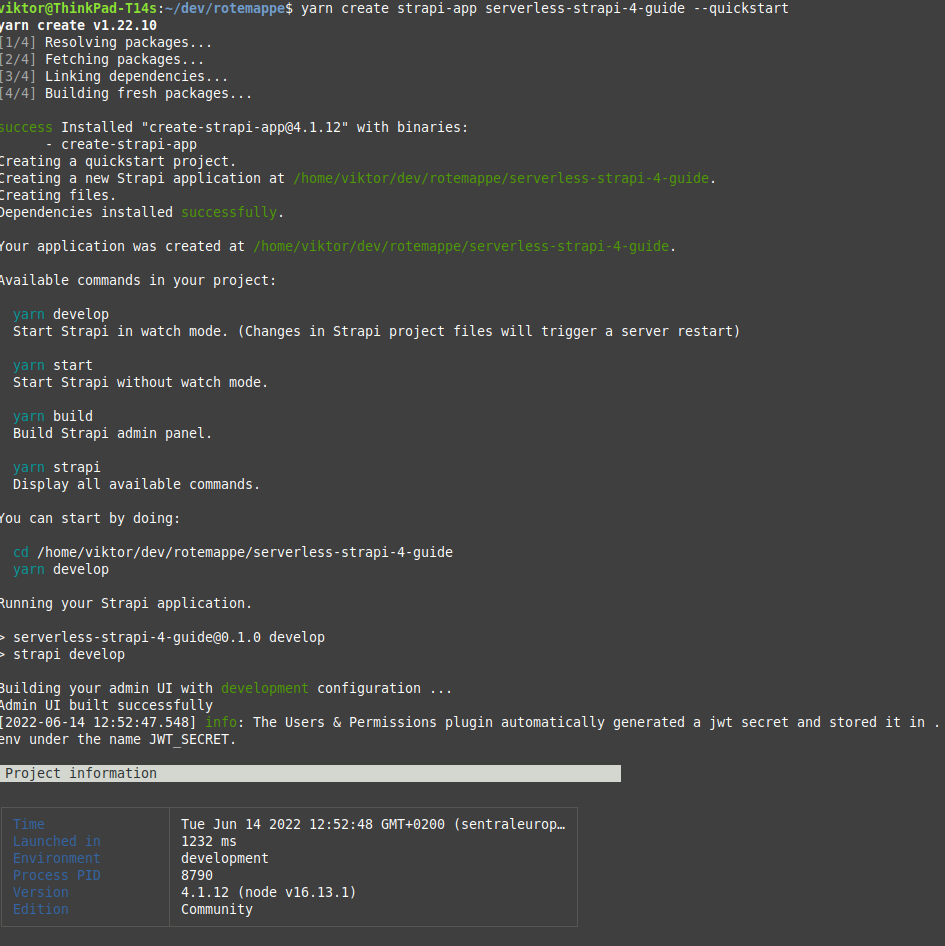

This will create a new folder and automatically install the dependencies, start Strapi and open a browser window. If it does not open, just visit http://localhost:1337/admin to see the admin dashboard. You can register a user to see that it works, but we will change databases and not use this user later.

Change to the newly created folder.


## Set up the Serverless framework

Install the dependencies and create a basic configuration in `serverless.yml`
```bash
npm install -g serverless
yarn add -D serverless-offline
yarn add serverless-http pg
```


```yaml
# serverless.yml

service: strapi-4-serverless-guide

frameworkVersion: "3"

provider:
  name: aws
  runtime: nodejs16.x
  region: eu-central-1 # NOTE: Update to your region
  logRetentionInDays: 1
  versionFunctions: false

  memorySize: 2048
  timeout: 30

package:
  excludeDevDependencies: true
  exclude: "**/**"
  include: "src/**"

functions:
  hello:
    handler: src/app.hello
    events:
      - http:
          path: /
          method: ANY
          cors: true
      - http:
          path: /{any+}
          method: ANY
          cors: true

plugins:
  - serverless-offline
```

We will first make a simple function just to see that we can run Serverless locally and deploy it without problems.

Create a file with a handler in `src/app.js`

```javascript
// src/app.js

module.exports.hello = async (event, context) => {
  return {
    body: JSON.stringify({ message: "Hello from Serverless" }),
    headers: { "Content-Type": "application/json" },
  };
};
```


Check that Serverless offline works with

```bash
yarn serverless offline
```

Go to http://localhost:3000/dev in your browser where you should get the response from `src/app.js`

Now, deploy the function to the AWS cloud.

```bash
yarn serverless deploy
```

If you have not used the Serverless framework before, you have to do some configuration. Create a role for serverless and make a user with the client id and client secret in `~/.aws/credentials`. See [the guide](https://www.serverless.com/framework/docs/providers/aws/guide/credentials/) from Serverless on how to do this on. If you don't have an AWS account yet, you can register one in the [AWS console](https://aws.amazon.com/console/).

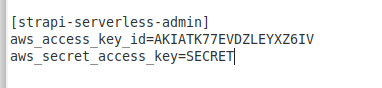
*This is the profile this guide will use from ~/.aws/credentials*


```bash
yarn serverless deploy --aws-profile strapi-serverless-admin
```

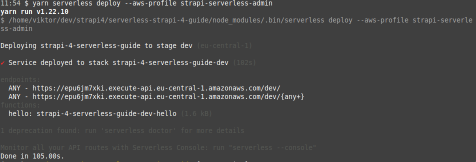

It should now be deployed and available on the url showed in the terminal. Visit the url to be sure that it works. 


## Creating a PostgreSQL database

If you already have a database you want to use with Strapi, you can skip this step and just configure `config/database.js` to connect to it. See the Strapi docs for more information.

This guide will set up a free tier PostgreSQL database in AWS. This is a good choice as it's free for 12 months and has good enough performance for using Strapi as a CMS. Having the database in the AWS system is also practical, as we don't need to subscribe to more services.
You can choose to use serverless AWS Aurora with PostgreSQL compatibility, but this offering does not have a free tier and will cost about 0.70$ per day for the cheapest option.

We will create the database in the AWS web console using so called "click ops". We could use CloudFormation and so called "infastructure as code". But it's quite cumbersome to define an Aurora database cluster in CloudFormation because of the sheer size and readability of the yaml file, the creation of a master password which is of risk of being leaked, and the risk of accidental deletion of the database when automatically updating the CloudFormation stack.

Go to the AWS web console and remember to switch to the region you want to deploy to. This guide will use eu-central-1. Search for RDS in the search bar and select RDS. Click the button to create a new database. 

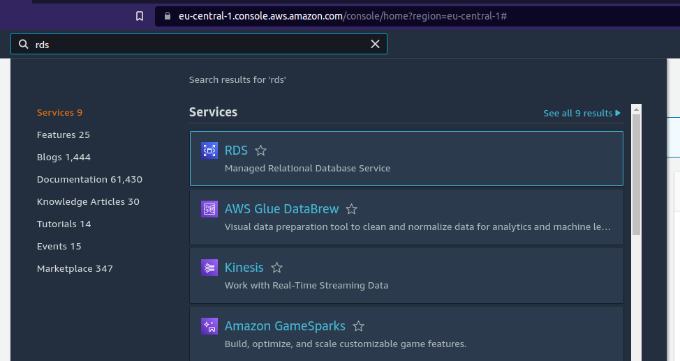

Select PostgreSQL as the database. It's probably a good idea to select the latest PostgreSQL version. Choose a cluster name, username and password. It's not a good idea to use the default username, as this makes the database more vulnerable to bots who automatically guess credentials. [Generate a password](https://passwordsgenerator.net/) 32 characters long with only letters and numbers as some special characters are not supported. Copy and paste the password somewhere as you will not see the password again.

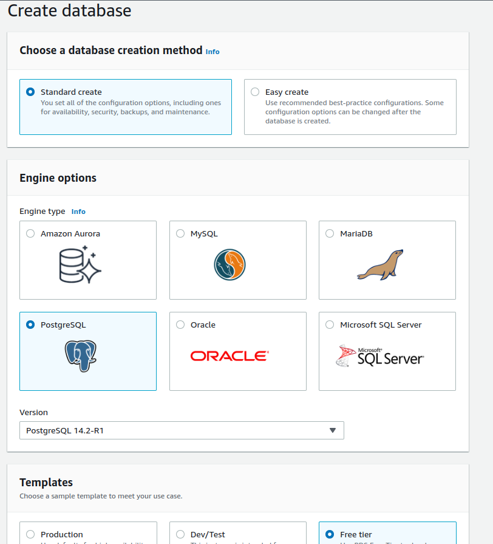

Choose the default db.t3.micro instance. You can of course modify the configuration to fit your needs, but this guide will choose the cheapest options. Select to create a new VPC.

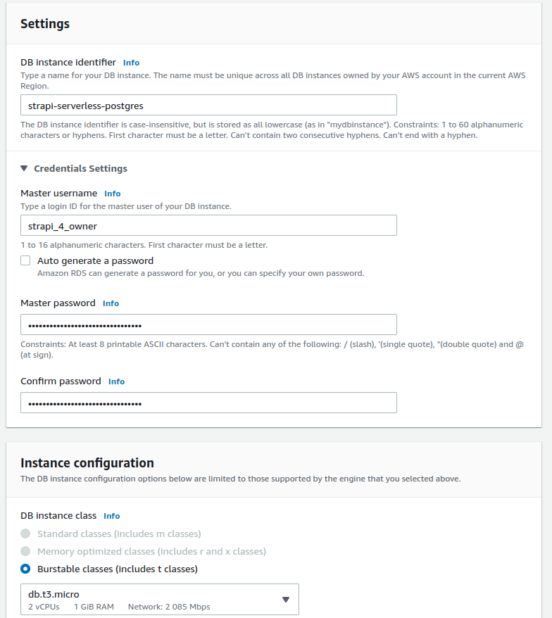
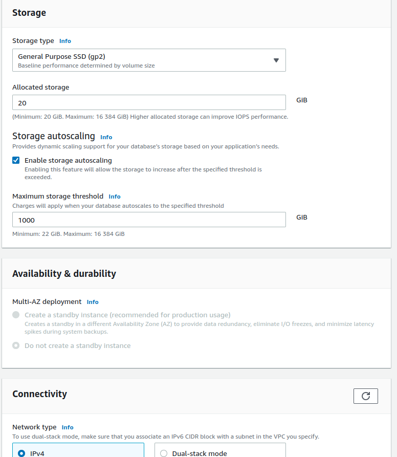

Check the "Allow public access" option and select create to create a new VPC security group.

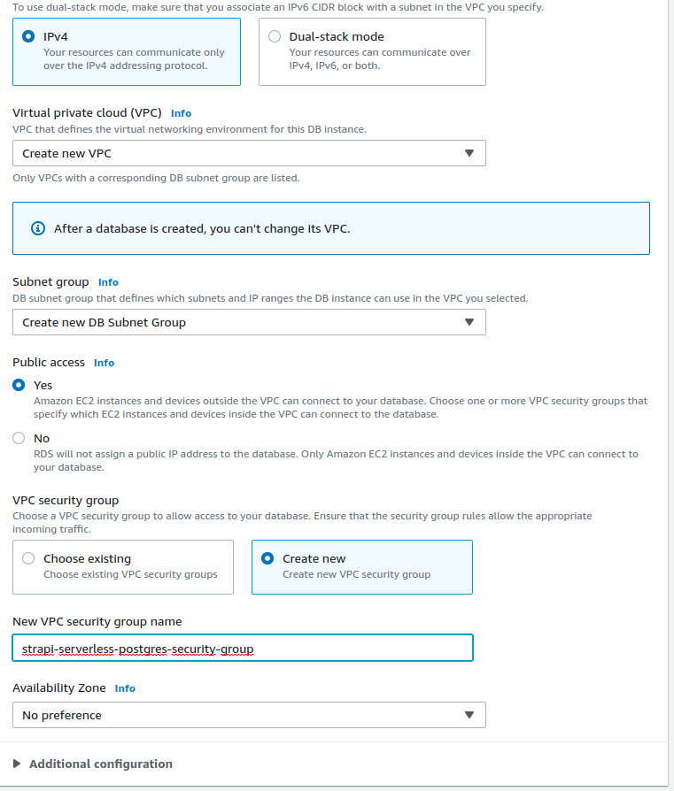

Monitoring can be useful if you plan to use this database in production, but it will add some cost if you go above the free tier of CloudWatch logs. Choose an initial database name such as "strapi4". The rest of the options can just the the default ones.

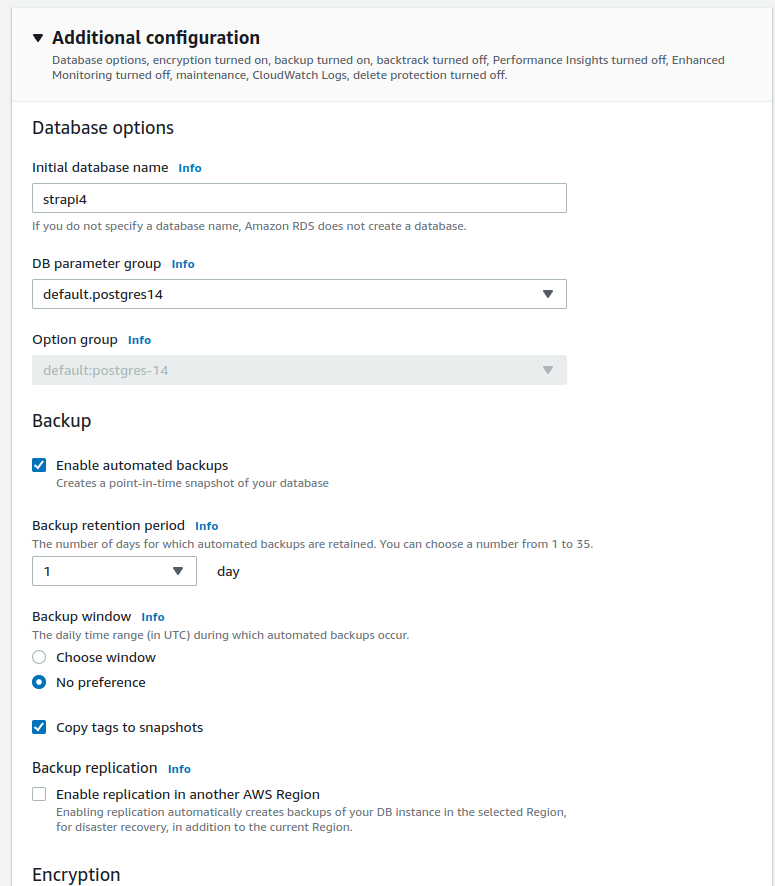
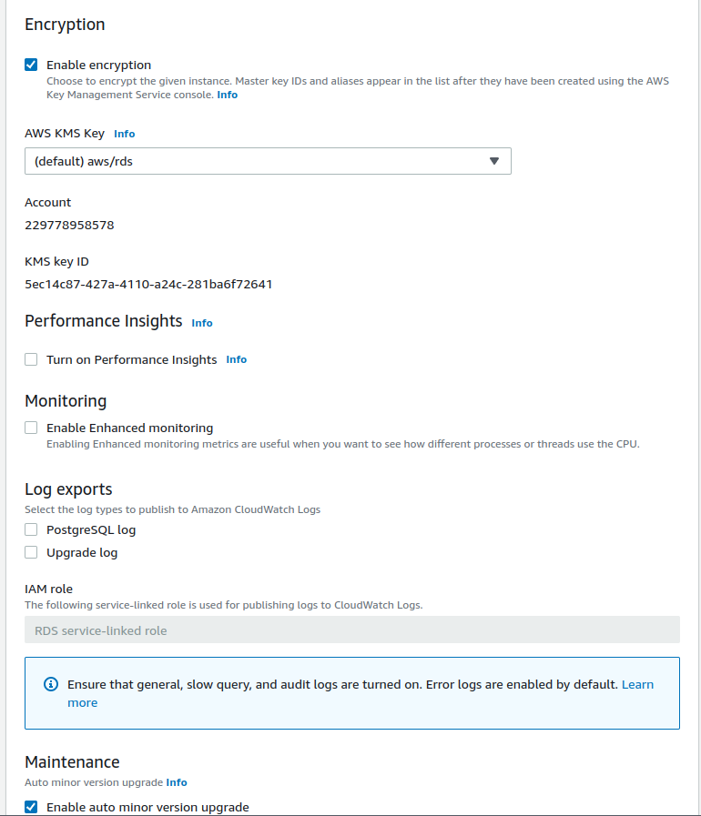

Scroll down and click the button to create the database. You will need to wait about 5 minutes for the instance to be ready. When it's ready you can see the endpoint which we will use to connect to the database from Strapi.

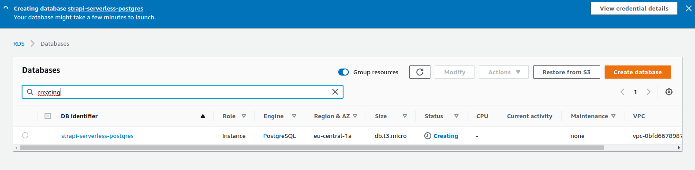

The last thing is to enable access from all IP addresses. Since we generated a long password, this is not a considerable security risk for most cases.

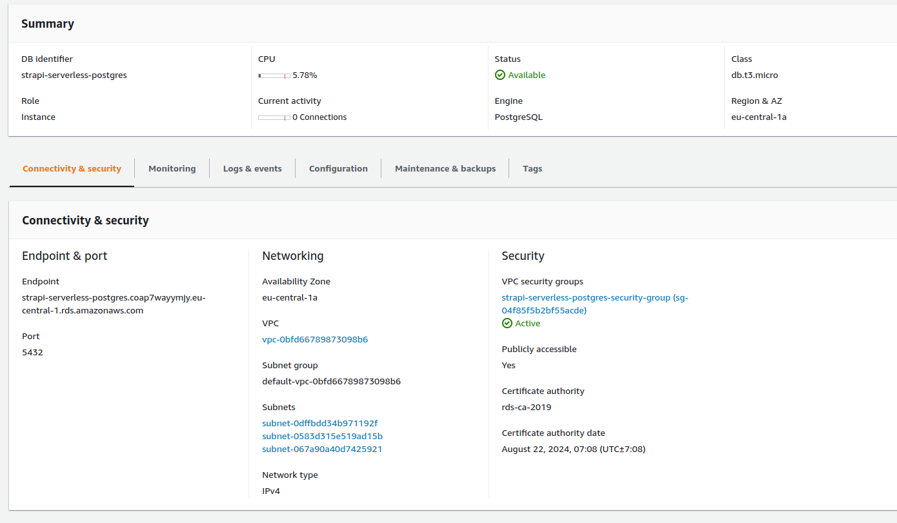

Under "Security" in the instance overview, select the VPC security group. Go to "Inbound rules" and click "Edit inbound rules". Select "Anywhere-IPv4" under "Source" and save. 

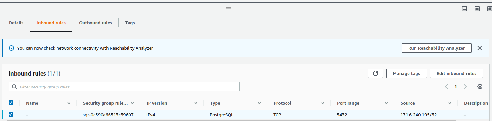
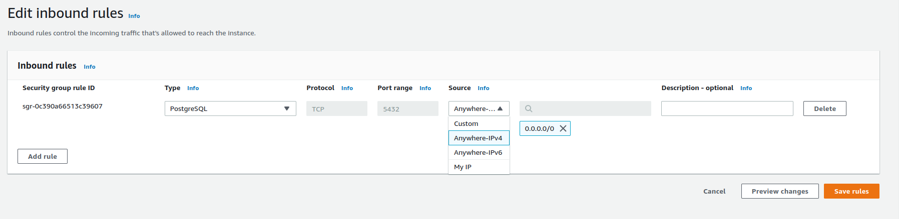

## Connecting to the new database with Strapi

Now that we have a database, we can configure Strapi to connect to it.

Populate the `.env` file with the credentials, database name and the host name. 

```
# ...
# Change to the values from the database configuration

SERVER_URL="https://localhost:3000/dev"
DATABASE_PASSWORD=ENTER_YOUR_DATABASE_PASSWORD
DATABASE_USERNAME=strapi_4_owner
DATABASE_NAME=strapi4
DATABASE_HOST="strapi-serverless-postgres.YOUR_HASH.eu-central-1.rds.amazonaws.com"
```

Then edit `config/database.js` to the following


```javascript
// config/database.js

module.exports = ({ env }) => ({
  connection: {
    client: "postgres",
    connection: {
      host: env("DATABASE_HOST", ""),
      port: env.int("DATABASE_PORT", 5432),
      database: env("DATABASE_NAME", ""),
      user: env("DATABASE_USERNAME", ""),
      password: env("DATABASE_PASSWORD", ""),
      schema: "public",
      ssl: {
        rejectUnauthorized: env.bool("DATABASE_SSL_SELF", false), // For self-signed certificates
      },
    },
    debug: false,
    // The connection pool can be adjusted, but these minimal limits seem to work well.
    pool: {
      min: 0,
      max: 1,
      idleTimeoutMillis: 500,
    },
  },
});
```


Run Strapi in development again to see that it works. You can now register a new user and create a content type if you want.

```bash
yarn develop
```

If everything works, we are ready to deploy to Lambda.  If `yarn develop` does not work properly, you might have to delete the `build` folder which is created whenever you run `yarn build`. 


## Strapi with Serverless

We have to configure Strapi in a certain way to make it work.

```javascript
// config/server.js

const getUrl = ({ env }) => {
  if (process.argv.join(" ").includes("strapi develop")) {
    return "";
  } else if (env.bool("IS_OFFLINE") || env.bool("BUILD_FOR_OFFLINE")) {
    return "http://localhost:3000/dev";
  } else {
    return env("SERVER_URL", "dev");
  }
};

module.exports = ({ env }) => ({
  host: env("HOST", "0.0.0.0"),
  port: env.int("PORT", 1337),
  app: {
    keys: env.array("APP_KEYS"),
  },
  url: getUrl({ env }),
});
```

```javascript
// config/admin.js

const getUrl = () => {
  if (process.argv.join(" ").includes("strapi develop")) {
    return "admin";
  } else {
    return "dev/admin";
  }
};

module.exports = ({ env }) => ({
  auth: {
    secret: env("ADMIN_JWT_SECRET"),
  },
  apiToken: {
    salt: env("API_TOKEN_SALT"),
  },
  url: getUrl(),
  autoOpen: false,
});
```


Before we run it in with Serverless, we need to update `src/app.js` and `serverless.yml`.

```javascript
// src/app.js

const serverless = require("serverless-http");
const Strapi = require("@strapi/strapi/lib/index.js");

module.exports.hello = async (event, context) => {
  return {
    body: JSON.stringify({ message: "Hello from Serverless" }),
    headers: { "Content-Type": "application/json" },
  };
};

const startStrapi = async (strapi) => {
  try {
    if (!strapi.isLoaded) {
      await strapi.load();
    }
    await strapi.postListen();
    strapi.server.mount();
    return strapi;
  } catch (error) {
    return strapi.stopWithError(error);
  }
};

module.exports.strapiHandler = async (event, context) => {
  let workingDir = process.cwd();
  if (process.env.LAMBDA_TASK_ROOT && process.env.IS_OFFLINE !== "true") {
    workingDir = process.env.LAMBDA_TASK_ROOT;
  }
  if (!global.strapi) {
    console.info("Cold starting Strapi");
    Strapi({ dir: workingDir });
  }
  if (!global.strapi.isLoaded) {
    await startStrapi(global.strapi);
  }
  const handler = serverless(global.strapi.server.app);
  return handler(event, context);
};
```

```yaml
# serverless.yml

service: strapi-4-serverless-guide

frameworkVersion: "3"
useDotenv: true

provider:
  name: aws
  runtime: nodejs16.x
  region: eu-central-1 # NOTE: Update to your region
  profile: strapi-serverless-admin # NOTE: Update to your profile name as in ~/.aws/credentials
  logRetentionInDays: 1
  versionFunctions: false

  memorySize: 2048
  timeout: 30

  environment:
    APP_KEYS: ${env:APP_KEYS}
    API_TOKEN_SALT: ${env:API_TOKEN_SALT}
    ADMIN_JWT_SECRET: ${env:ADMIN_JWT_SECRET}
    JWT_SECRET: ${env:JWT_SECRET}

    SERVER_URL: ${env:SERVER_URL}
    DATABASE_PASSWORD: ${env:DATABASE_PASSWORD}
    DATABASE_USERNAME: ${env:DATABASE_USERNAME}
    DATABASE_NAME: ${env:DATABASE_NAME}
    DATABASE_HOST: ${env:DATABASE_HOST}

package:
  excludeDevDependencies: true
  exclude:
    - "**"
  include:
    - "build/**"
    - "config/**"
    - "database/**"
    - "node_modules/**"
    - "public/**"
    - "src/**"
    - ".env.example"
    - "package.json"
    - "!node_modules/esbuild-linux-64/**"
    - "!node_modules/@babel/**"
    - "!node_modules/@types/**"
    - "!node_modules/webpack/**"
    - "!node_modules/@sentry/**"

functions:
  api:
    handler: src/app.strapiHandler
    events:
      - http:
          path: /
          method: ANY
          cors: true
      - http:
          path: /{any+}
          method: ANY
          cors: true

plugins:
  - serverless-offline
```

Now we can check that it works with Serverless offline. First, we need to build the frontend with `BUILD_FOR_OFFLINE=true yarn build`

```bash
BUILD_FOR_OFFLINE=true yarn build
serverless offline
```

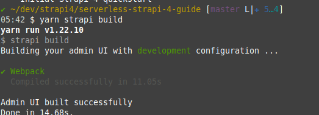

Go to http://localhost:3000/dev/index.html then log in see see that it works. Strapi is now connected to the database in the cloud and running on Lambda locally.

We can now deploy to the cloud

```
serverless deploy
```

It should upload successfully. Note that the UI will not work, as we use `http://localhost:3000/dev` as the SERVER_URL. After running `serverless deploy` you should see a url in the format of `https://YOUR_HASH.execute-api.eu-central-1.amazonaws.com/dev` in the console. Copy this and paste it in `.env`.

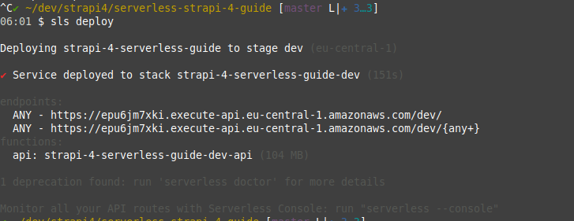

```
# .env
# ...
SERVER_URL="https://YOUR_HASH.execute-api.eu-central-1.amazonaws.com/dev"
# ...
```

You can see the logs from lambda with

```bash
serverless logs -f api -t
```

While the GUI will not work, you can check that the API works by going to `https://YOUR_HASH.execute-api.eu-central-1.amazonaws.com/dev/api/users`. You should get a `403 Forbidden response`. If you get a 5xx response, something is wrong, and you can check the logs to debug it.

After you have inserted the correct `SERVER_URL` environment variable to `.env`, we can build and deploy again. 

```bash
yarn build
serverless deploy
```

Visit `https://YOUR_HASH.execute-api.eu-central-1.amazonaws.com/dev` and login to the GUI. The username and password you chose locally should work here too, as we use the same database.

If it works, congratulations! You have successfully deployed Strapi with Lambda. 


## What's next

### Deploying the frontend separately

It's possible to split up the Strapi app and deploy the frontend on a separate static site. This will Make the initial loading of the site a little bit faster, and also save you a few requests to API Gateway and Lambda. To do this, you need to edit `config/admin.js` and change the url to the domain you're hosting on. Then run `yarn build` and deploy the `build` folder to whatever static site hosting you prefer.

### Use Lambda URL

It's possible to invoke a [Lambda directly](https://docs.aws.amazon.com/lambda/latest/dg/lambda-urls.html) with HTTP without using API Gateway. This will save some cost if you go above the free tier of Lambda and API Gateway. The backside is that the Serverless Offline plugin will not work, so you can't test your app locally easily. You can use Lambda URL by adding the following to `serverless.yml` and removing `dev` from the url in `config/server.js` and `config/admin.js`

```yaml
# serverless.yml
#...
functions:
  api-url:
    handler: src/app.strapiHandler
    url:
      cors: true
#...
```

### Further reduce the package size

If you use additional Strapi plugins or dependencies, your package size might get higher than the maximum limit for Lambda. More dependencies can safely be removed from `node_modules` by adding them under `include` in `serverless.yml`. All the frontend dependencies can be safely removed if you host the frontend separately.

### Deploy several Strapi instances

If you need to deploy several Strapi instances, you can configure this project differently or just make several copies of the project. Each instance needs its own database, but you can use the same AWS PostgreSQL database cluster for several databases without any extra cost. Just create a new database with an SQL query in PostgreSQL. 

### Upload images and static assets

You can use S3 to host your images and static assets in Strapi. The [previous guide](/posts/serverless-strapi-tutorial/) explains how to do this in Strapi 3. It should be fairly similar to do it in Strapi 4. 

## Feedback

Mention me on Twitter on @vikfand or send a mail to vikfand@gmail.com. 

Check the [Github repo](https://github.com/viktorfa/strapi-4-serverless-guide) for the full code used.
