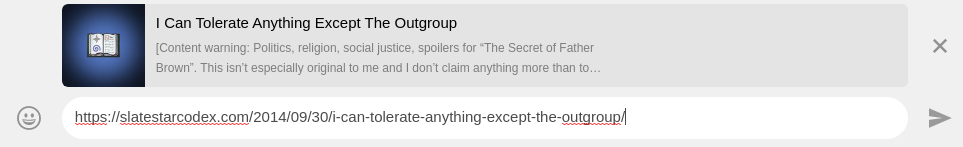
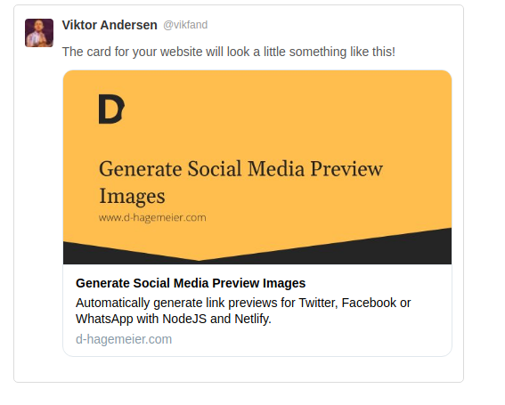
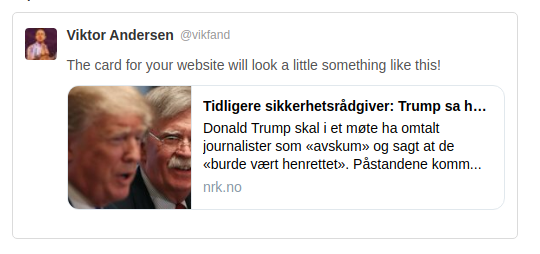
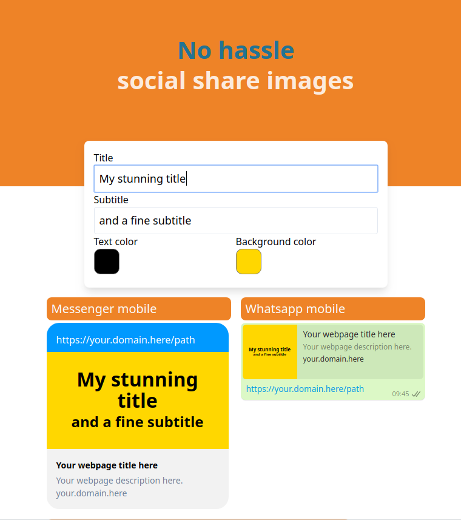

I had an idea for a very simple SaaS. Quick generation of social media preview images. 
Website owners can choose a featured image to be shown whenever a page is shared on social media. Having a good image is important, as it makes people quickly see what the link is about, and make them more likely to click it. But it is quite a pain in the ass (PITA) to manage these images, as they need to have correct dimensions, and you might want to have a different image for each of your thousands of articles.

Bloggers and article writers often select a *featured image* for each piece of content that is used as an for an internal link, like the front page of an online newspaper. The featured image is also often highly visible above the text content on the page. A common problem is that this image will be shown when a page is shared on social media, but it does not have the correct proportions. So we get situations when half of John Bolton's face is shown on the link preview or something like that.
Content creators can crop a custom photo for the social sharing purpose, but this can be tedious. 
Some big sites seem to always do this, perhaps automatically, to make really good social share preview images with a relevant image and perhaps some text and/or logo laid on top. 
But there's no easy way to do this for most sites, as we can see by observing the bad state of social share preview images around the web. 

[slatestarcodex.com](http://slatestarcodex.com) is an excellent blog, but it lacks a good social preview image for its articles.

D Hagemeier automatically creates good social share images for his blog posts by programming a script.

A solution is to simply use a title and a subtitle as input, and output an appropriate image with the right dimensions. D Hagemeier shows how this can be done in an [inspiring article](https://www.d-hagemeier.com/en/articles/generate-social-media-preview-images/) from December 2010. Hagemeier is a talented programmer and does this automatically with is own script. I want to make such a script available for anyone to use so easily that it's effortless. It can be done by instead of first creating an image when publishing an article, you use an url link that includes the title and subtitle. The url points to my server which generates an image on the fly.

The idea is so simple I kinda expect somebody else to have done this already. They just need a server that generates an image based on some input text, and that's it. Even of there were somebody doing this, it's clearly not widespread enough, as many great websites lack good preview images for their pages. Even though, with a solution like I had in mind, it would be easy to generate a good image for all your pages.

After writing the first draft of this article, I found out there are at least two similar services out there: [bannerbear.com](http://bannerbear.com) and [placid.com](https://placid.com). Both offer a service to generate images based on text, which you can then insert into your web page. But only Placid offers to generate an image on the fly with a simple get request. This last solution is as far as I can think of, much easier for a website owner to manage.

Placid seems like such a good product I'm quite doubtful whether it's worth competing with them. The only strategy I can think of is just making a much simpler product, and allow for free trials with no time limit. Placid seems to have grown to a huge app supporting things like generating images for Instagram and integrating with Airtable. This can seem like too much for, say a developer who wants better preview images for her blog, which is why a strategy for my service could be to make it dead simple to get started with.

Placid allows free (as in beer) use of its API, but not with your own templates. There's a technical reason for this, as you can't really control who uses an API of this kind. Each person using the API will cost some money to the server owner, so my idea only works if enough people pay for a premium version. Perhaps by being really lean, the costs will be low enough for such a business model to work.

Maybe my product could have a landing page with a preview generator and the exact url need to create that. Premium features could be remove watermark, add logo, custom fonts, or other customization.

This product could risk getting a helluva lot of queries, as we can't really control who wants to generate an image. If it's not abused, though, Facebook and I suppose other apps cache the social preview images themselves. This service should also store images it generates so that it can cheaply serve them when asked a second time.

## Say hi to Sharizard

[Sharizard](https://sharizard.com/) is the product I launched for this social share preview image generator. It was quick to make an MVP, and I'm using it for my own sites already. The name aims to be playful, as the product is primarily aimed at small time developers, bloggers and website owners. The main competitor, Placid, has a name I don't know how to explain, but it sounds a bit colder in my opinion. Shout out to my old friend Shahariar for first coming up with this awesome name.

