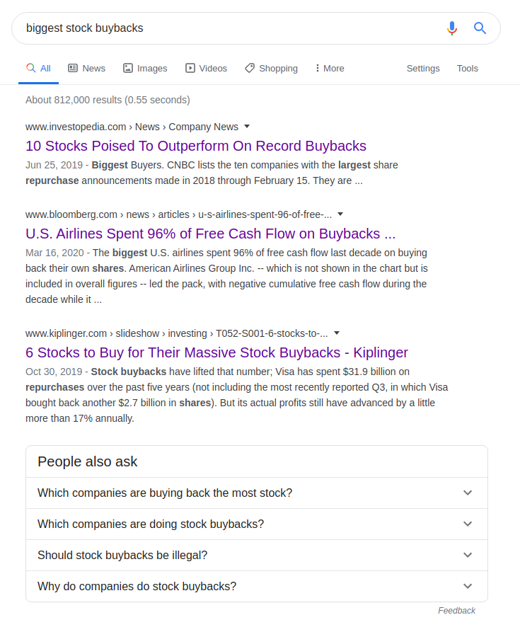
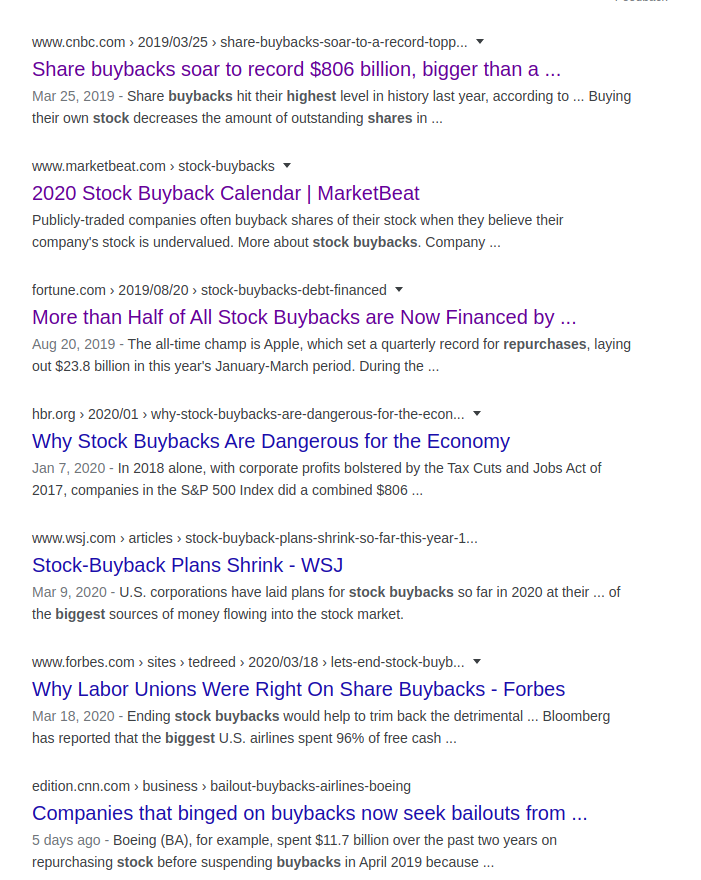

## Hva er stock buybacks

Stock buybacks eller "tilbakekjøp av egne aksjer" er når et selskap kjøper sine egne aksjer. Aksjer ligger ute på børsen hvor hvem som helst – privatpersoner, fond, og selskap – kan kjøpe dem. Det er da ingen teknisk grunn til at et selskap ikke kan kjøpe _tilbake_ sine egne aksjer.

Tilbake er et nøkkelord, for husk at alle aksjer i utangspunktet er en eierandel av et selskap som selskapet selv lager og selger for å skaffe investorer. Hver aksje i et aksjeselskap representerer et eierandel av selskapet. Èn aksje i et selskap med 100 aksjer tilsvarer 1% av selskapet, og det gir eieren rett til 1% av overskuddet til bedriften i fremtiden hvis bedriften bruker overskuddet til utbytte.

En bedrift kan gå med overskudd og overføre pengene i form av utbytte til aksjeeierene. Bedriften kan også avgjøre at overskuddet burde brukes på andre måter. Som å investere i nye maskiner, nye ansatte, betale tilbake gjeld, osv.
En kontroversiell bruk av overskuddet er å kjøpe tilbake egne aksjer. Det gir ikke særlig mye mening at et selskap skal bytte egne penger mot egne aksjer, da formålet med aksjer er å gjøre det motsatte: å selge aksjer slik at bedriften får penger. Det gir heller ingen fortrinn til bedriften å eie aksjer. Det bedrifter skal gjøre med kapital er å investere for å forbedre seg selv, og hvis det ikke er mulig, betale utbytte til eierene som belønning for at de investerte tidligere.

I de siste årene har vi sett en voldsom økning i etterkjøp av egne aksjer i store selskaper. Det kan ha negetive konsekvenser for økonomien, og er også et tegn på at noe er fundamentalt galt.

## Hvorfor stock buybacks

På grunn av tilbud og etterspørsel så vil prisen på en aksje stige når noen kjøper store mengder av den. Dvs at et selskap med betydelige mengder cash kan få sin egen aksjepris til å stige ved å kjøpe egne aksjer. Dette gir ingen fortrinn til bedriften, men det gjør de eksisterende eierene av aksjene rikere.

Mange av de største selskapene i vår verden er offentlige aksjeselskap med enorme markedsverdier, det vi på engelsk ofte kaller corporations. Grunnleggerne av disse selskapene er døde for lenge siden, og etterkommerne deres er ikke involvert i driften. Selskapene drives daglig av C-gjengen (CEO, CFO, CTO, CMO, ...), og selskapets strategi settes av styret. Siden det ikke er noen grunnlegger eller visjonær person involvert her, så blir hele formålet med selskapet å "tjene eierenes interesser", som vil si å tjene penger.

C-gjengen har krevende jobber med mye ansvar, så de blir godt kompensert med en høy lønn. Men det som virkelig kan gjøre dem rike eller ikke lønninga, men _stock options_ eller "aksjemuligheter". En stock option er et derivat av en aksje. Det høres komplisert ut, men det er bare en mulighet til å kjøpe en aksje til en fast pris i fremtiden. For selskapets daglige ledelse virker det som følger:

Mr Smith blir ansatt som CEO i Boeing når Boeings aksje koster 100 dollar. Selv om Mr Smith har grad fra Harvard, har ledet andre selskaper med suksess tidligere, og er knallgod på jobbintervjuer, så kan ikke styret helt sikkert vite om de ansatte riktig person. "Vil Mr Smith drive selskapet godt, og hvordan kan vi måle det?", tenker de.
De finner ut at dersom aksjeprisen øker mens Mr Smith er daglig leder, så betyr det at han er en god leder. Mr Smith lover at hans geniale ledelse vil øke aksjeprisen, men løfter betyr ikke mye, så de finner ut at de vil gi Mr Smith soleklare insentiver til å øke aksjeprisen. De gir ham stock options i Boeing. Han får retten til å kjøpe aksjer nåværende pris, 100 dollar, etter han har ledet selskapet i 5 år.
Da skjønner Mr Smith at økning i aksjeprisen vil gå rett i hans lomme, så han styrer med aksjeprisen som kompass.
Når Mr Smith et par år senere sitter med CFO-en, Mrs Johnson, og diskuterer hva de skal gjøre med overskuddet, så vet begge at å kjøpe tilbake egne aksjer vil gjøre dem begge rike. Da blir det fort sånn at de velger bort å investere i nye maskiner eller å videreutdanne sine ansatte, og heller kjøper egne aksjer.
De som allerede eier aksjer, og de som eier stock options vinner. Alle andre taper. Må ikke selskapet etterhvert høste det de sår? Jo, men da er Mr Smith og Mrs Johnson gått av for lenge siden, og uansett vil jo myndighetene redde dem i en krise.

## Lave renter og stock buybacks

Hadde selskaper kun brukt eget overskudd på å kjøpe tilbake aksjer, hadde problemet vært begrenset. Problemet blir større når selskaper kan ta lån og så bruke de lånte pengene på å drive med stock buybacks.
Lave renter oppfordrer bedrifter til å ta lån for å investere i bedriften og slik gjøre økonomien bedre. Lave renter betyr at man kan få masse penger idag, og betale tilbake bare litt mer i fremtiden. Hvis man tror man kan bruke de lånte pengene på å tjene mer penger, er det da nesten idiotisk å ikke ta lån. For C-gjengen og de med stock options er det nesten idiotisk å ikke ta lån og bruke de lånte pengene på stock buybacks, da det er en steinenkel måte å øke aksjeprisen på uten å gjøre det vanskelige arbeidet med å øke overskuddet eller få større markedsandel.

Vi har som kjent helt siden finanskrisen hatt historisk lave renter over en lang periode. Det har blant annet ført til høye boligpriser i Norge og høye aksjepriser globalt.
