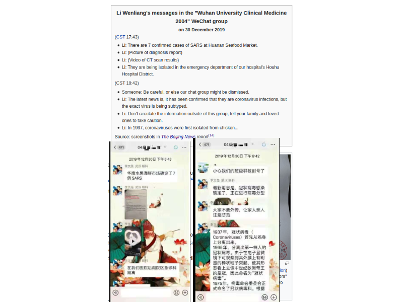
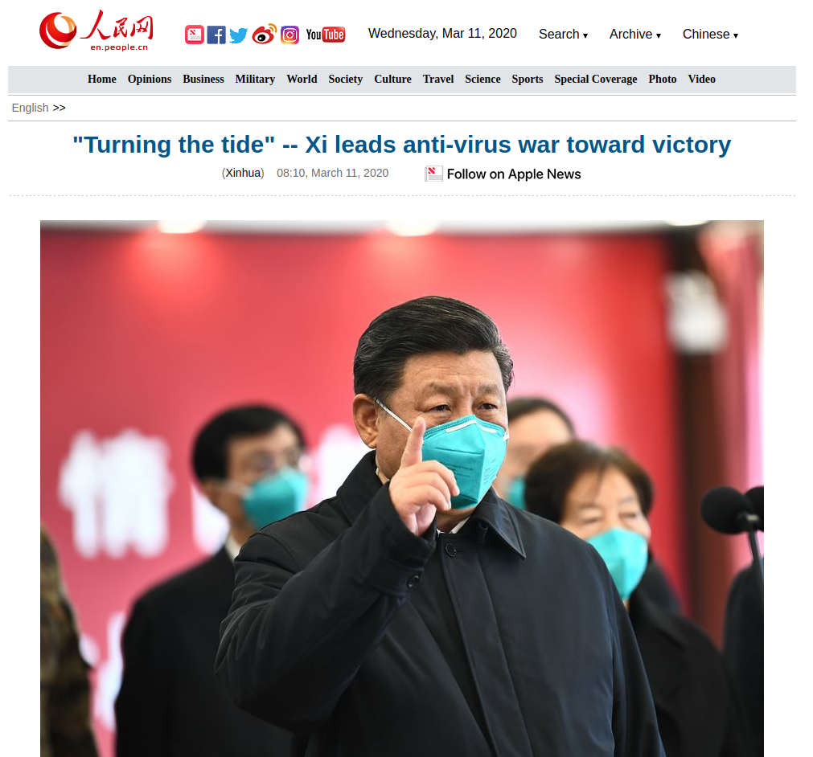
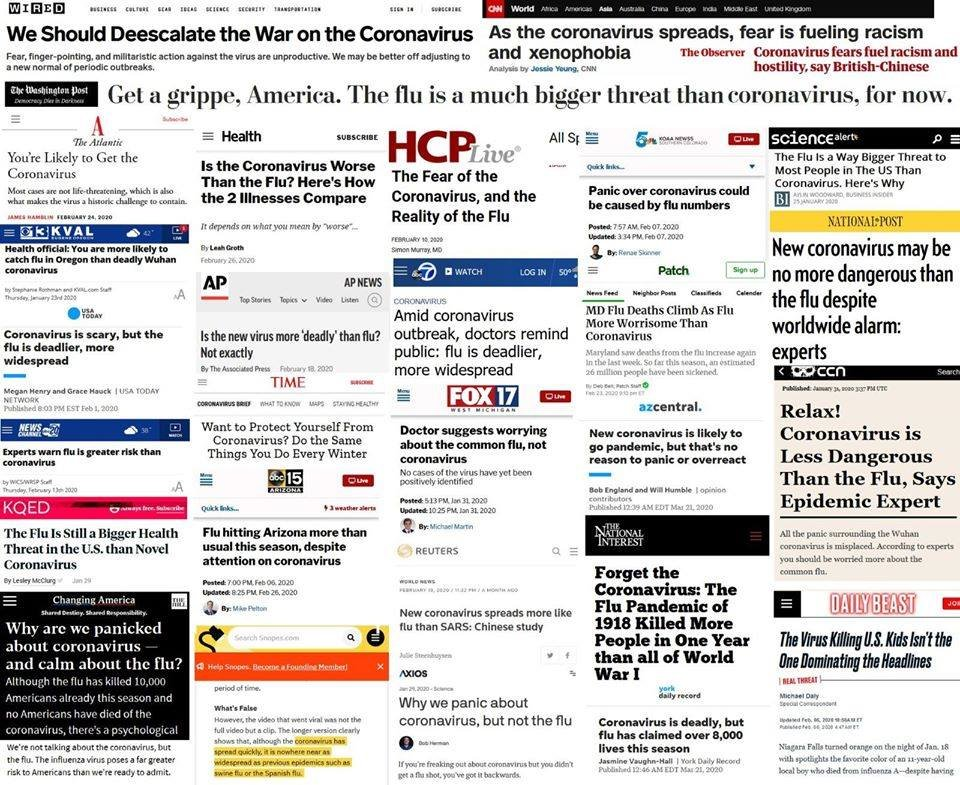
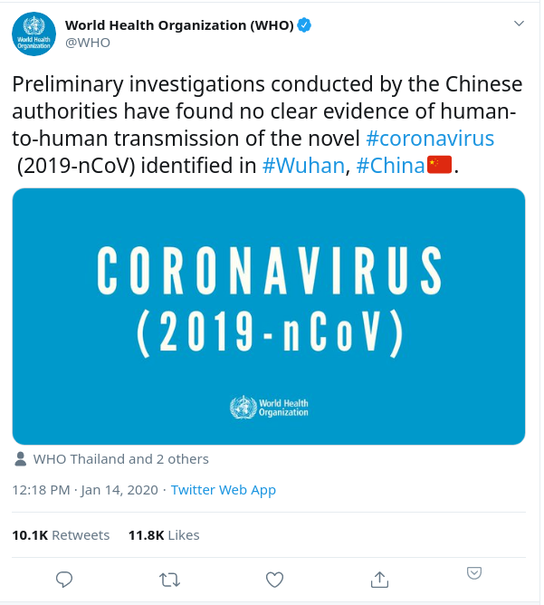
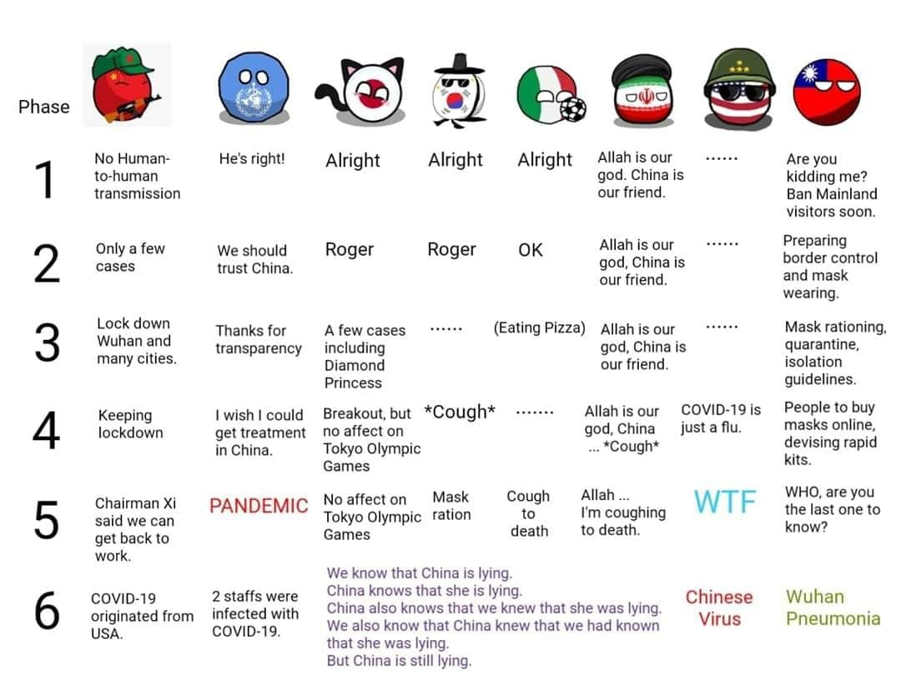

De som følger nyheter om Kina tett har hatt et spennende år i år. Det kommer stadig utrolige nyheter fra Kina, men de fleste sakene forblir begrenset til spesielt interesserte. Denne gangen har det gått helt overbord, og både Kinas og og internasjonale organisasjoners håndtering av koronaviruset har blitt noe alle må ta stilling til.

## Uklare kinesiske tegn i januar

Allerede i januar begynte det å komme tweets og noen artikler om et mulig nytt utbrudd av noe tilsvarende SARS. De som kjenner Kina litt vet at nyhetene om SARS ble kraftig nedspilt av kinesiske myndigheter i sin tid. Under SARS-utbruddet hadde mediene i Kina et snev av frihet til å drive uavhengig journalistikk, men det var likevel ikke lett å få nyheter ut under kommunistpartiets vake. Nå i 2020 er mediene i Kina under _mye_ mer press fra myndighetene, og knapt noe som helst blir trykket dersom redaktører og journalister kan tenke seg at det faller i dårlig jord hos partiets ledelse. I januar var det derfor svært usikkert hva som foregikk, og hvor seriøst det var.

Midt under den kinesiske nyttårsfeiringen fikk vi et tegn som kunne tolkes tydelig. Mens verdens største årlige migrasjon av kinesere som reiser fra byene til hjembygda var i full gang, ble ordre gitt fra øverste hold i kommunistpartiet om å stenge all trafikk inn og ut av Wuhan. Det var et drastisk grep som tydet på at det som foregikk var alvorlig. Om kommunistpartiets ledelsesmåte er kjent for noe, så er det å handle innmari drastisk når de først handler. Ofte er det overreaksjoner som fører til tragedier, men det er et klart tegn på hva lederne prioriterer å få gjort.

På grunn av stor kontroll av media i Kina er det svært vanskelig for observatører å få et godt bilde over hva som foregår. Det man stort sett ser er enten gladnyheter eller fordømmelser, mens ubekreftede rykter spres hele tiden over internett. De gruppene som faktisk vet hva som foregår er de som jobber på gulvet og lokale myndigheter. Begge disse gruppene er livredde for å skape trøbbel ved å komme med dårlige nyheter, så ting blir ofte ikke rapportert opp. Dr Li Wenliang er en av de på gulvet som snakket litt for høyt om mulige dårlige nyheter. Han ble straffet for å spre falske rykter, for å så dø av koronaviruset og etterlate seg en gravid kone. Dette tragiske dødsfallet skapte så store reaksjoner hos kinesere at sensurmyndighetene unngikk å fjerne frustrerte Wechat-poster med subtil kritikk av styresmaktene. Men da støvet la seg noen dager senere ble de sensurert igjen.

Hvorfor oppførte myndighetene i Wuhan seg sånn de gjorde mot Dr Li? De var selv livredde for å komme med dårlige nyheter til sjefene sine i Beijing. De håpet at det hele ville gå over av seg selv, og visste at det bare var noe å tape ved å komme med bekymringer.

Li Wenliang ble avhørt av politiet for å ha spredt usanne rykter, og tvunget til å skrive under på en innrømmelse av skyld. Selv om ryktespredning kan ha negative konsekvenser, er dette en ganske så undertrykkende handling av myndighetene. Og sett i konteksten av at ryktene han spredde kun foregikk i en privat chatgruppe for kolleger og alumni fra universitetet hans er det nesten Orwelliansk. Det skal sies at Dr Li faktisk sa at utbruddet var av _SARS_, noe som faktisk var ubekreftet, men myndighetenes reaksjon var fortsatt litt overdreven.  
Det var akkurat i disse dager at verdens helsemyndigheter og epidemiforskere spent venta på mer informasjon fra Kina. Viktig og faktabasert informasjon som bekreftelse på smitte og genomdata kom ut senere, men man spekulere i om verden hadde fått bedre informasjon fortere dersom miljøet for diskusjon og åpenhet hadde vært bedre i Kina. Vi aner ikke hvor mange leger og forskere som visste noe, men ikke turte lufte tankene da de visste at selv å dele informasjon med kolleger kunne føre til avhør av politiet.

_Denne artikkelen har ikke med begynnelsen av utbruddet å gjøre, men legg merke til språkbruk og mild persondyrkelse i kinesisk statsmedia._

## Tid til å reagere

Siste halvdel av januar var et kritisk periode, fordi resten av verden kunne ganske tydelig se alvoret, og vi hadde da fortsatt tid til å begrense spredningen. Til tross for dette ble lite gjort. Vårt mediebilde besto grovt sagt av to deler. Den første delen var sensasjonalisme, eller artikler som trigget redsels– og bekymringsinstinktene våre. Den andre delen besto av "fornuftsposering", en motreaksjon på den første delen, der offentlige personer og profesjonelle "meningshavere" spilte ned alvoret av situasjonen ved å si at viruset ikke var verre enn influensa, og at grensekontroll var en ufornuftig overreaksjon, osv. I den første delen brukte man de hurtig voksende offisielle tallene fra Kina til å spre frykt. Den andre delen sammenlignet de samme tallene med statistikk fra vanlig influensa uten å forstå at vanlig influensa er kjent, under kontroll, og allerede globalt, mens det nye viruset er ukjent, ikke ennå globalt, og vokser eksponensielt. Ingen var kritiske til de offentlige tallene fra Kina, som garantart ikke har noe med virkeligheten å gjøre.

Vi sto da ovenfor en "long tail" situasjon. Det vil si at de mulige scenarionene for fremtiden ikke spente fra _litt dårlig_ til _litt bra_, men rommet av mulige utfall inkluderte _ekstremt dårlig_. Hva som faktisk ville skje var ukjent, antakeligvis ville det gå bra, men en potensielle nedsiden var kjempestor. Som å seile over Skagerrak uten å sjekke værmeldingen. Antakeligvis går det bra, og det er ingen bevis på at det blir storm. Men hvis det skulle bli storm er du ferdig, og sannsynligheten for storm er ikke neglisjerbar.

Jeg har litt sympati for politikerne i den situasjonen. De kunne satt igang tiltak som kunne reddet oss senere, men ingen ville takke dem for det. For i ettertid kunne man sagt: "Der ser du, det var ikke verre enn influensa!". Ved å ikke gjøre noe slapp man å ta et vanskelig valg, og man kunne fortsatt komme og redde dagen senere. En politiker kunne også vise til anbefalinger fra supranasjonale organisasjoner som WHO, og slik beskytte sitt eget skinn ved å hevde at ingen visste bedre.

## Verdens inkompetente helseorganisasjon

En organisasjon som er skapt for å hjelpe oss i slike situasjoner er verdens helseorganisasjon (WHO). En supranasjonal organisasjon som blomstrer i denne globaliseringens tid. Akkurat som med FN vet alle nordmenn at disse organisasjonene uten tvil kjemper for _det gode_. Her har ingen ringere enn vår egen landsmoder, Gro Harlem Brundtland, tjent som generalsekretær.

Det er nok mange personer med stort talent og høy etisk standard i en slik organisasjon, men toppledelsen består stort sett av pensjonerte toppolitikere, og andre som vil ha en prestisjefull tittel og delta på prektige toppmøter. Noen av disse toppmøtene finner sted i Kina, og Kina har som nasjonal strategi å sørge for at deltakere på slike møter får en uforglemmelig opplevelse og blir sittende med et inntrykk av midtens rike som godt.

WHO fikk faktisk rapporter med viktig informasjon fra medlemsland i god tid for å stoppe spredningen av viruset. Kina rapporterte den 31. desember om en ny type lungebetennelse av ukjent opphav. Samme dag kom også Taiwan, som blir utestengt fra WHO pga. Kina, med advarsler. Taiwan har et helt spesielt forhold til Kina, og er antakeligvis landet i verden best skikket til å se gjennom offentlige usannheter fra sin store nabo. Sammen med Macau og Hong Kong begynte Taiwan å undersøke tilreisende fra Wuhan fra 31. desember, som vil si at disse tre myndighetene var de første til å iverksette smittebegrensning av noe slag. Til tross for at over en million taiwanesere jobber i Kina, har øynasjonen klart å begrense spredningen merkverdig, uten engang å innføre lockdown eller andre ekstreme tiltak. Kun Nord-Korea som stengte grensene allerede 21. januar ser ut til å bli skånet i større grad enn Taiwan.

WHO er er institusjon med tyngde. Det de sier og gjør blir sett av både politikere, journalister, og vanlige folk. Du har sikkert lagt merke til at flere apper nå viser en liten infomelding om koronaviruset, og denne inneholder en lenke til ingen andre enn WHO. Med dette følger et enormt ansvar, og idealer som sannhet og åpenhet bør stå høyere enn politisk manøvrering. Det er her WHO kom til kort i denne krisen.

Av et ønske om å ha et godt forhold til Kina har organisasjonen gang på gang uttalt seg feilaktig eller ufullstendig. Etter en Den 14. januar uttalte de at det ikke fantes klart bevis for at viruset var smittsomt. Ja ok, men at det ikke finnes bevis er ikke et bevis på at det ikke er noe der. Hvorfor sa de dette da situasjonen fortsatt var uklar, om det ikke var for å tilfredsstille Kina?

Den nåværende generalsekretæren for WHO sa litt senere at Kina håndterte situasjonen eksemplarisk. Virkelig? Der en lege fra Wuhan ble avhørt av politiet for å dele informasjon om viruset med kolleger i en privat chatgruppe, for å senere dø av sykdommen han prøvde å redde oss fra. Der tilfeller ble bekreftet så tidlig som november. Der vi nå vet at forskning på viruset [ble tiet ned i desember](https://www.nationalreview.com/news/chinese-authorities-gagged-laboratories-in-december-over-coronavirus-sars-connection/). Der WHO ble varslet allerede 31. desember, mens i Kina var emnet praktisk talt forbudt å diskutere offentlig før 23. januar.
WHO kom også den 31. januar med en uttalelse om at reiserestriksjoner ikke var nødvendige. Etter at flere land hadde begynt med omfattende restriksjoner, og nå i mars er mindre rammet på grunn av disse.

Det som fikk meg til å begynne å skrive denne artikkelen var da epidemolog i WHO Bruce Aylward med skammelig feighet nektet å svare på spørsmål relatert til Taiwan. Han nektet i det hele tatt å nevne Taiwan. Alle som har fulgt Kina litt vet hvordan Taiwan systematisk blir utelukket fra internasjonele organisasjoner, og hvordan Kina prøver å styre den offentlige oppfattelsen av Taiwan som et land. Det at hotellkjeder blir truet med utestengelse fra det kinesiske markedet dersom de ikke lister Taiwan som en region av Kina er ikke hovedpoenget med WHOs håndtering av koronaviruset, men det viser hvor stor rolle politikk og ønske om å ha et godt forhold med Kina styrer WHOs dagsorden.

[https://twitter.com/BonnieGlaser/status/1243907343269666818](https://twitter.com/BonnieGlaser/status/1243907343269666818)

En organisasjon som priser Kinas håndtering av viruset og som nekter å engang nevne at Taiwan eksisterer som et uavhengig land. Kan vi regne med at de baserer seg på nøytrale fakta, eller er de blitt et jakttrofe for Kinas kommunistparti?

[Li Wenliang (Wikipedia)](https://en.wikipedia.org/wiki/Li_Wenliang)  
[Utbruddets tidslinje (Wikipedia)](https://en.wikipedia.org/wiki/Timeline_of_the_2019%E2%80%9320_coronavirus_pandemic_from_November_2019_to_January_2020)  
[Reiserestriksjoner ifm. viruset (Wikipedia)](https://en.wikipedia.org/wiki/Travel_restrictions_related_to_the_2019%E2%80%9320_coronavirus_pandemic)  
[Systemic Risk of Pandemic via Novel Pathogens](https://threadreaderapp.com/thread/1221486205847646208.html) – en artikkel som beskriver potensielle katastrofale følger av nye patogener i en verden som er så sammenkoblet som vår.  
[Artikkel om Bruce Aylwards respons til spørsmål om Taiwan (NRK)](https://www.nrk.no/urix/brak-etter-at-who-nestsjef-nektet-a-svare-om-taiwan-1.14965483)
